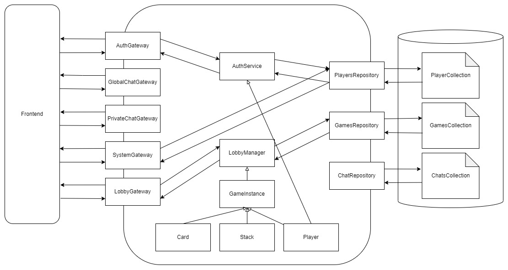

# Dokumentation: The Game

FS 2023, Web Engineering, Fabian Diemand  
Dozent: Ilir Fetai  
Repository: https://git.ffhs.ch/fabian.diemand/webe_the_game/

---

## Inhalt
<!-- TOC -->
* [Dokumentation: The Game](#dokumentation--the-game)
  * [Inhalt](#inhalt)
  * [1 Einleitung](#1-einleitung)
  * [2 Erklärung des Spiels](#2-erklärung-des-spiels)
    * [2.1 Spielaufbau](#21-spielaufbau)
    * [2.2 Ziel des Spiels](#22-ziel-des-spiels)
    * [2.3 Spielregeln](#23-spielregeln)
    * [2.4 Spielregeln "On Fire"](#24-spielregeln--on-fire-)
  * [3 Projektplanung](#3-projektplanung)
    * [3.1 Meilenstein 1](#31-meilenstein-1)
    * [3.2 Meilenstein 2](#32-meilenstein-2)
    * [3.3 Meilenstein 3](#33-meilenstein-3)
    * [3.4 Meilenstein 4](#34-meilenstein-4)
  * [4 Anforderungen](#4-anforderungen)
    * [4.1 Funktionale Anforderungen](#41-funktionale-anforderungen)
      * [4.1.1 UC #1 - Registration](#411-uc-1---registration)
      * [4.1.2 UC #2 - Login](#412-uc-2---login)
      * [4.1.3 UC #3 - Spielregeln](#413-uc-3---spielregeln)
      * [4.1.4 UC #4 - Allgemeine Lobby](#414-uc-4---allgemeine-lobby)
      * [4.1.5 UC #5 - Nutzende zu Freundesliste hinzufügen](#415-uc-5---nutzende-zu-freundesliste-hinzufügen)
      * [4.1.6 UC #6 - Nutzende von Freundesliste entfernen](#416-uc-6---nutzende-von-freundesliste-entfernen)
      * [4.1.7 UC #7 - Freunde Lobby](#417-uc-7---freunde-lobby)
      * [4.1.8 UC #8 - Spieltisch](#418-uc-8---spieltisch)
      * [4.1.9 UC #9 - Chatting](#419-uc-9---chatting)
      * [4.1.10 UC #10 - Normales Spiel](#4110-uc-10---normales-spiel)
      * [4.1.11 UC #11 - Spiel "On Fire"](#4111-uc-11---spiel--on-fire-)
      * [4.1.12 UC #12 - Schnellinterventionen](#4112-uc-12---schnellinterventionen)
      * [4.1.13 UC #13 - Spielstatistiken](#4113-uc-13---spielstatistiken)
    * [4.2 Nicht-Funktionale Anforderungen](#42-nicht-funktionale-anforderungen)
      * [4.2.1 Leistungsanforderungen](#421-leistungsanforderungen)
      * [4.2.2 Qualitätsanforderungen](#422-qualitätsanforderungen)
      * [4.2.3 Randbedingungen](#423-randbedingungen)
  * [5 Eingesetzte Technologien](#5-eingesetzte-technologien)
    * [5.1 NodeJS (TypeScript)](#51-nodejs--typescript-)
    * [5.2 Yarn](#52-yarn)
    * [5.3 ReactJS (HTML/ CSS/ TypeScript) - nicht 100% sicher](#53-reactjs--html-css-typescript----nicht-100-sicher)
    * [5.4 Socket.io](#54-socketio)
    * [5.5 MongoDB](#55-mongodb)
    * [5.6 Docker](#56-docker)
    * [5.7 Gitlab](#57-gitlab)
  * [6 Datenmodell](#6-datenmodell)
  * [7 UI Prototyp](#7-ui-prototyp)
    * [7.1 Landing Page](#71-landing-page)
    * [7.2 Registration Page](#72-registration-page)
    * [7.3 Retrieve Code Page](#73-retrieve-code-page)
    * [7.4 Reset Password Page](#74-reset-password-page)
    * [7.5 Lobby Page](#75-lobby-page)
    * [7.6 Game Page](#76-game-page)
    * [7.7 Profile Page](#77-profile-page)
  * [8 Architekturentscheidungen](#8-architekturentscheidungen)
    * [8.1 Kommunikationsprotokoll](#81-kommunikationsprotokoll)
      * [8.1.1 Chatting](#811-chatting)
      * [8.1.2 Spielverlauf](#812-spielverlauf)
      * [8.1.3 Kurzinterventionen](#813-kurzinterventionen)
      * [8.1.3 Ausserhalb des Spiels](#813-ausserhalb-des-spiels)
    * [8.2 Server](#82-server)
  * [9 Deploymentkonzept](#9-deploymentkonzept)
  * [10 Installationsanleitung](#10-installationsanleitung)
  * [Quellen](#quellen)
<!-- TOC -->

---

## 1 Einleitung

Das folgende Dokument enthält die Dokumentation der Semesterarbeit im Modul WebE (Web Engineering), des
Frühlingssemesters 2023 an der Fernfachhochschule Schweiz (nachfolgend FFHS). Im Kern geht es dabei um die Umsetzung
einer web-basierten Applikation (fortan Web-App).

## 2 Erklärung des Spiels

Die Web-App wird ein Kartenspiel und ist die Umsetzung des bekannten Kartenspiels **"The Game - Spiel solange du
kannst..."**. Die Spielregeln und der Spielaufbau ergeben sich somit direkt aus jenen
des [realen Kartenspiels](https://www.gamefactory-spiele.com/the-game).

Informationen zum Spiel:

|                |                                     |
|----------------|-------------------------------------|
| Alter          | 8+ Jahre                            |
| Anzahl Spieler | 1 - 5                               |
| Dauer          | 20+ Minuten                         |
| Karten         | 98 Zahlenkarten, Werte von 2 bis 99 |

### 2.1 Spielaufbau

Zu Beginn gibt es vier Einzelkarten (Zielkarten) die auf der Spielfläche liegen und vier Ablegestapel anzeigen. Von den
98 Zahlenkarten erhält jede:r Spieler:in eine gewisse Anzahl verdeckt ausgeteilt. Die Anzahl Handkarten hängt von der
Anzahl Spielender ab (siehe folgende Tabelle). Die verbleibenden Zahlenkarten dienen verdeckt als Nachziehstapel.

| Anzahl Spielender | Anzahl Handkarten pro Spieler:in |
|-------------------|----------------------------------|
| 3, 4, 5           | 6                                |
| 2                 | 7                                |
| 1                 | 8                                |

### 2.2 Ziel des Spiels

Das Spiel basiert auf einem kollaborativen Ansatz. Alle Spieler:innen verfolgen also als Team das Ziel, das Spiel zu
besiegen. Dies ist geschafft, wenn sämtliche 98 Spielkarten auf die vier Ablegestapel abgelegt werden konnten.

### 2.3 Spielregeln

Die Spieler:innen versuchen reihum, ihre Karten auf die Ablegestapel abzulegen. Wichtig ist dabei, dass zwei Stapel
aufsteigend (2 - 100) und zwei Stapel absteigend (99 - 1) bedient werden müssen. Dabei muss die numerische Reihenfolge
der Werte respektiert werden (z.B., auf einem absteigenden Ablagestapel darf keine 55 auf eine 49 gelegt werden).
Solange auf dem Nachziehstapel noch Karten liegen, **müssen** alle Spieler:innen darüber hinaus in jeder Runde zwei
Karten ablegen. Sobald der Nachziehstapel keine Karten mehr enthält, **muss** in jeder Spieler in jeder Runde nur noch
eine Karte ablegen. Jede:r Spieler:in füllt nach dem Ablegen die Handkarten wieder vom Nachziehstapel auf.

Mit dem **Rückwärtstrick** können Kartenstapel gerettet werden. Es ist erlaubt, eine Karte mit einer exakten Differenz
von 10 (nicht 20, 30, etc.), entgegen der Zählrichtung (auf- bzw. absteigend) eines Ablagestapels zu legen. Dadurch wird
der Wert des Stapels wieder um 10 erhöht, bzw. gesenkt und es können mehr Karten abgelegt werden.

### 2.4 Spielregeln "On Fire"

Nebst dem Basisspiel soll auch der Spielmodus "On Fire" spielbar sein. Die Spielkarten mit den Werten **22, 33, 44, 55,
66 und 77** werden speziell gekennzeichnet und mit der Regel versehen, dass sie **zwingend sofort (d.h. vom Spielenden,
oder von der:dem nächsten Spieler:in) überdeckt** werden müssen. Kann das nicht erfüllt werden, ist das Spiel sofort
verloren.

## 3 Projektplanung

### 3.1 Meilenstein 1

**Abgabe: 26.02.2023 (PVA2 - 1d), Nachbearbeitung: 10.03.2023 (PVA3 - 2d)**  
Fokus dieses Meilensteines ist eine möglichst granulare Planung des Endproduktes. Der Programmieraspekt steht hier noch
im Hintergrund. Es sollen sowohl Mockups erstellt und genaue Anforderungen definiert werden. Folgende Punkte sollen in
dem Projektdokument geschildert und in dem Repository in dem Ordner "docs" hinterlegt werden.

- [X] Beschreibung des Ziels des Spieles und der zugehörigen Spielregeln.
- [X] Beschreibung der Anforderungen (Funktional, Nicht-Funktional, KANN, MUSS).
- [X] Präsentation der Anforderungen an die zu entwickelnde Software
- [X] Mockups für das Frontend, sowohl für Desktop als auch für Mobile Devices
- [X] Erste Auflistung der verwendeten Technologien und Bibliotheken
- [X] Kurze Beschreibung des Protokolls zwischen Client und Server
    - Welche Daten werden übertragen
    - Welchem Zweck dient der Austausch
    - Welcher Transportweg wird gewählt (WebSocket oder AJAX)

### 3.2 Meilenstein 2

**Abgabe: 26.03.2023 (PVA4 - 1d), Nachbearbeitung: 07.04.2023 (PVA5 - 2d)**  
Das Frontend, die Einarbeitung des Feedbacks aus dem ersten Meilenstein sowie eine Ausarbeitung der
Kommunikationsstrategie bilden den Fokus dieser Abgabe. Bereits ausprogrammiert soll die Anmeldung durch den Client beim
Server sein, damit die Kommunikation für spätere Schritte bereits gegeben ist. Das Frontend soll, neben der Anmeldung,
bereits grob strukturiert sein, muss allerdings nicht vollständig sein.

- [X] Erweiterung des Kommunikationsschemas (Protokollplanung)
- [ ] Anmeldung eines Clients beim Server
- [ ] Möglichkeit, Nachrichten vom Client an den Server zu schicken mit angemeldetem Benutzer
- [ ] Möglichkeit der Kommunikation unter den Clients
- [ ] Grundgerüst Frontend
- [ ] Grundgerüst des Servers

### 3.3 Meilenstein 3

**Abgabe: 23.04.2023 (PVA6 - 1d), Nachbearbeitung: 05.05.2023 (PVA7 - 2d)**  
In diesem Schritt werden sowohl Server- wie auch Client-Seite weiterentwickelt. Insbesondere über den State der
Applikation sollen die gemachten Gedanken implementiert und ausprogrammiert werden. Die Logik der Applikation oder des
Spiels soll bereits vollständig stehen und programmiert sein. Das Projekt soll also bereits bedienbar sein. Es wird noch
nicht erwartet, dass sämtliche Kontroll- und Speichermechanismen vollständig implementiert sind.

- [ ] Verwaltung des State auf dem Client und auf dem Server
- [ ] Bedienbare Version des Projektes
- [ ] Erweiterte Version des Servers
- [ ] Erweiterte Version des Clients

### 3.4 Meilenstein 4

**Abgabe: 21.05.2023 (PVA8 - 1d), Nachbearbeitung: 02.06.2023 (PVA9 - 2d)**  
Mit dem Stand dieses Meilensteins muss das Projekt in der nächsten Präsenzveranstaltung präsentiert werden.
Dementsprechend muss die Funktionalität so komplett wie möglich integriert und das Projekt vollständig sein. Nach der
Präsenzveranstaltung werden noch zwei Wochen zur Verfügung gestellt. Dieser Puffer sollte allerdings nicht für fehlende
Features, sondern für Bugfixes und finalisierende Politur des Projektes dienen.

- [ ] Feature-complete Version des Servers
- [ ] Feature-complete Version des Clients
- [ ] Kontrolle, ob alle Anforderungen realisiert wurden
- [ ] Auflistung, was noch Verbessert werden muss und/oder was noch nicht erledigt wurde

## 4 Anforderungen

Die Anforderungen an die Web-App ergeben sich aus der Aufgabenstellung im Modulplan der FFHS, den Spielregeln (
vgl. [Abschnitt 2](#2-erklärung-des-spiels)) von "The Game" und Ideen des Entwicklers, welche die Vorgaben ergänzen.

### 4.1 Funktionale Anforderungen

#### 4.1.1 UC #1 - Registration

<table>
  <tr>
    <th>Name</th>
    <td>UC #1 - Registration</td>
  </tr>
  <tr>
    <th>Ziel</th>
    <td>Die Spielenden registrieren sich als Nutzende der Applikation.</td>
  </tr>
  <tr>
    <th>Akteure</th>
    <td>Nutzende</td>
  </tr>
  <tr>
    <th>Vorbedingung</th>
    <td>Nutzende sind nicht bereits registrierte Spielende.</td>
  </tr>
  <tr>
    <th>Auslösendes Ereignis</th>
    <td>Nutzende klicken auf die "Registrieren"-Oberfläche.</td>
  </tr>
  <tr>
    <th>Nachbedingung Normalfall</th>
    <td>Nutzende erhalten eine Erfolgsmeldung im UI.</td>
  </tr>
  <tr>
    <th>Nachbedingung Sonderfall</th>
    <td>
      2a. Fehlende Felder werden gekennzeichnet, Formular wird nicht abgeschlossen
      3a. Invalide Felder werden gekennzeichnet, Formular wird nicht abgeschlossen 
    </td>
  </tr>
  <tr>
    <th>Normalfall</th>
      <td>
        1. Nutzende werden auf die "Registrieren"-Page weitergeleitet <br>
        2. Nutzende geben ihre persönlichen Daten an <br>
        3. Die Daten werden validiert <br>
        4. Für die nutzende Person wird ein Spieler:innen-Profil angelegt <br>
      </td>
  </tr>
  <tr>
    <th>Sonderfall</th>
    <td>
      2a. Nutzende haben nicht alle Daten angegeben <br>
      3a. Die persönlichen Daten der Nutzenden werden als invalide erkannt.
    </td>
  </tr>
</table>

#### 4.1.2 UC #2 - Login

<table>
  <tr>
    <th>Name</th>
    <td>UC #2 - Login</td>
  </tr>
  <tr>
    <th>Ziel</th>
    <td>Registrierte Nutzende können sich einloggen.</td>
  </tr>
  <tr>
    <th>Akteure</th>
    <td>Registrierte Nutzende</td>
  </tr>
  <tr>
    <th>Vorbedingung</th>
    <td>Nutzende haben durch eine Registration bereits ein Profil erhalten.</td>
  </tr>
  <tr>
    <th>Auslösendes Ereignis</th>
    <td>Nutzende klicken auf die "Login"-Oberfläche.</td>
  </tr>
  <tr>
    <th>Nachbedingung Normalfall</th>
    <td>
      Nutzende erhalten eine Erfolgsnachricht, werden eingeloggt und haben nun Zugang zu ihrem
      Profil, sowie zu allen Funktionen des Spiels.
    </td>
  </tr>
  <tr>
    <th>Nachbedingung Sonderfall</th>
    <td>
      2a. Fehlende Felder werden gekennzeichnet, Formular wird nicht abgeschlossen
      4a. Generische Fehlernachricht wird angezeigt 
    </td>
  </tr>
  <tr>
    <th>Normalfall</th>
      <td>
        1. Ein "Login"-Dropdown wird angezeigt <br>
        2. Nutzende geben ihre Authentifikations-Daten (Username, Passwort) an <br>
        3. Nutzende klicken auf "Login"-Knopf <br>
        4. Authentifikations-Daten werden verifiziert <br>
        5. Nutzende werden eingeloggt <br>
      </td>
  </tr>
  <tr>
    <th>Sonderfall</th>
    <td>
      2a. Nutzende füllen nicht alle Felder aus <br>
      4a. Authentifikations-Daten werden als invalide erkannt <br>
    </td>
  </tr>
</table>

#### 4.1.3 UC #3 - Spielregeln

<table>
  <tr>
    <th>Name</th>
    <td>UC #3 - Spielregeln</td>
  </tr>
  <tr>
    <th>Ziel</th>
    <td>Alle Nutzenden (nicht angemeldet, angemeldet) können die Regeln des Spiels einsehen</td>
  </tr>
  <tr>
    <th>Akteure</th>
    <td>Nutzende</td>
  </tr>
  <tr>
    <th>Vorbedingung</th>
    <td>Keine</td>
  </tr>
  <tr>
    <th>Auslösendes Ereignis</th>
    <td>Nutzende klicken auf die "Spielregeln" Schaltfläche.</td>
  </tr>
  <tr>
    <th>Nachbedingung Normalfall</th>
    <td>Keine</td>
  </tr>
  <tr>
    <th>Nachbedingung Sonderfall</th>
    <td>Keine</td>
  </tr>
  <tr>
    <th>Normalfall</th>
    <td>
      1. Spielregeln werden angezeigt <br>
      2. Nutzende lesen Spielregeln <br>
      3. Nutzende verlassen die Spielregeln-Übersicht wieder <br>
    </td>
  </tr>
  <tr>
    <th>Sonderfall</th>
    <td>Keine</td>
  </tr>
</table>

#### 4.1.4 UC #4 - Allgemeine Lobby

<table>
  <tr>
    <th>Name</th>
    <td>UC #4 - Allgemeine Lobby</td>
  </tr>
  <tr>
    <th>Ziel</th>
    <td>Angemeldete Nutzende befinden sich in einer Lobby mit potenziellen Mitspieler:innen auf demselben Server.</td>
  </tr>
  <tr>
    <th>Akteure</th>
    <td>Angemeldete Nutzende</td>
  </tr>
  <tr>
    <th>Vorbedingung</th>
    <td>
      1. Nutzende sind angemeldet <br>
      2. Nutzende befinden sich auf der "Home"-Ansicht des Spiels <br>
      3. Nutzende haben keinen Filter der Übersicht aktiviert <br>
    </td>
  </tr>
  <tr>
    <th>Auslösendes Ereignis</th>
    <td>Keines</td>
  </tr>
  <tr>
    <th>Nachbedingung Normalfall</th>
    <td>
      Nutzende erhalten eine Übersicht aller weiteren Nutzenden, die beim Server angemeldet sind.
    </td>
  </tr>
  <tr>
    <th>Nachbedingung Sonderfall</th>
    <td>
      Eine Meldung über fehlende Mitspieler wird angezeigt und es können nur Einzeltische direkt gestartet werden.
    </td>
  </tr>
  <tr>
    <th>Normalfall</th>
      <td>
        1. Es sind Nutzende beim selben Server angemeldet.
      </td>
  </tr>
  <tr>
    <th>Sonderfall</th>
    <td>
        1a. Es sind keine Nutzenden beim Server angemeldet.
    </td>
  </tr>
</table>

#### 4.1.5 UC #5 - Nutzende zu Freundesliste hinzufügen

<table>
  <tr>
    <th>Name</th>
    <td>UC #5 - Nutzende zu Freundesliste hinzufügen</td>
  </tr>
  <tr>
    <th>Ziel</th>
    <td>Nutzende können sich gegenseitig in Freundeslisten verwalten.</td>
  </tr>
  <tr>
    <th>Akteure</th>
    <td>Sender:in (Nutzende:r), Empfänger:in (Nutzende:r)</td>
  </tr>
  <tr>
    <th>Vorbedingung</th>
    <td>Akteure sind angemeldet.</td>
  </tr>
  <tr>
    <th>Auslösendes Ereignis</th>
    <td>Sender:in will Empfänger:in zur Freundesliste hinzufügen.</td>
  </tr>
  <tr>
    <th>Nachbedingung Normalfall</th>
    <td>Sender:in und Empfänger:in werden zur gegenseitigen Freundesliste hinzugefügt.</td>
  </tr>
  <tr>
    <th>Nachbedingung Sonderfall</th>
    <td>
        3a. Empfänger:in erhält keine Anfrage <br>
        4a. Empfänger:in erhält Anfrage beim nächsten Login <br>
        5a. Empfänger:in wird nicht zur Freundesliste hinzugefügt <br>
    </td>
  </tr>
  <tr>
    <th>Normalfall</th>
      <td>
        1. Sender:in wählt Empfänger:in aus der Liste der Nutzenden aus <br>
        2. Sender:in klickt die "Zur Freundesliste einladen"-Oberfläche <br>
        3. Sender:in bestätigt im folgenden Pop-Up die Anfrage <br>
        4. Anfrage wird an den:die Empfänger:in geschickt <br>
        5. Empfänger:in bestätigt Anfrage <br>
      </td>
  </tr>
  <tr>
    <th>Sonderfall</th>
    <td>
        3a. Sender:in bricht die Aktion im Pop-Up ab <br>
        4a. Empfänger:in geht Offline <br>
        5a. Empfänger:in lehnt Anfrage ab <br>
        5b. Sender:in erhält die Information über die Ablehnung <br>
    </td>
  </tr>
</table>

#### 4.1.6 UC #6 - Nutzende von Freundesliste entfernen

<table>
  <tr>
    <th>Name</th>
    <td>UC #6 - Nutzende von Freundesliste entfernen</td>
  </tr>
  <tr>
    <th>Ziel</th>
    <td>Nutzende können sich aus Freundeslisten entfernen.</td>
  </tr>
  <tr>
    <th>Akteure</th>
    <td>Nutzende</td>
  </tr>
  <tr>
    <th>Vorbedingung</th>
    <td>Akteure sind angemeldet.</td>
  </tr>
  <tr>
    <th>Auslösendes Ereignis</th>
    <td>Nutzende:r will sich aus einer Freundesliste entfernen.</td>
  </tr>
  <tr>
    <th>Nachbedingung Normalfall</th>
    <td>
        Nutzer:in und Gegenüber wurden aus der jeweils anderen Freundesliste entfernt.
    </td>
  </tr>
  <tr>
    <th>Nachbedingung Sonderfall</th>
    <td>
        Freundeslisten verbleiben unverändert. Keine Nachricht an Gegenüber.
    </td>
  </tr>
  <tr>
    <th>Normalfall</th>
      <td>
        1. Nutzende:r sucht die entsprechende Person in der eigenen Freundesliste <br>
        2. Nutzende:r klickt die "Aus Freundesliste entfernen"-Oberfläche <br>
        3. Nutzende:r bestätigt im Pop-Up die Aktion <br>
        4. Gegenseite erhält die entsprechende Information <br>
      </td>
  </tr>
  <tr>
    <th>Sonderfall</th>
    <td>
        3a. Nutzende:r bricht die Aktion ab.
    </td>
  </tr>
</table>

#### 4.1.7 UC #7 - Freunde Lobby

<table>
  <tr>
    <th>Name</th>
    <td>UC #7 - Freunde Lobby</td>
  </tr>
  <tr>
    <th>Ziel</th>
    <td>Nutzende von der Freundesliste sind in einer eigenen Lobby einsehbar.</td>
  </tr>
  <tr>
    <th>Akteure</th>
    <td>Nutzende</td>
  </tr>
  <tr>
    <th>Vorbedingung</th>
    <td>Nutzende sind eingeloggt.</td>
  </tr>
  <tr>
    <th>Auslösendes Ereignis</th>
    <td>Nutzende wollen "The Game" spielen.</td>
  </tr>
  <tr>
    <th>Nachbedingung Normalfall</th>
    <td>
        Die Übersicht zeigt alle eingeloggten Nutzenden, die auch auf der Freundesliste sind. <br>
    </td>
  </tr>
  <tr>
    <th>Nachbedingung Sonderfall</th>
    <td>
        Der:die Nutzende erhält eine entsprechende Nachricht in der leeren Übersicht. <br>
    </td>
  </tr>
  <tr>
    <th>Normalfall</th>
    <td>
        1. Angemeldete Nutzende sehen eine Übersicht eingeloggten Nutzenden auf der Freundesliste <br>
    </td>
  </tr>
  <tr>
    <th>Sonderfall</th>
    <td>
        1a.1. Keine Nutzenden auf der Freundesliste sind angemeldet. <br>
        1a.2. Die Freundesliste ist leer.
    </td>
  </tr>
</table>

#### 4.1.8 UC #8 - Spieltisch

<table>
  <tr>
    <th>Name</th>
    <td>UC #8 - Spieltisch</td>
  </tr>
  <tr>
    <th>Ziel</th>
    <td>Nutzende können Spieltische für eine bestimmte Anzahl Mitspielender und einen der beiden Modi kreieren.</td>
  </tr>
  <tr>
    <th>Akteure</th>
    <td>Nutzende</td>
  </tr>
  <tr>
    <th>Vorbedingung</th>
    <td>Nutzende sind angemeldet.</td>
  </tr>
  <tr>
    <th>Auslösendes Ereignis</th>
    <td>Nutzende wollen eine Runde "The Game" spielen.</td>
  </tr>
  <tr>
    <th>Nachbedingung Normalfall</th>
    <td>
        Tisch mit der entsprechenden Konfiguration wurde erstellt.
    </td>
  </tr>
  <tr>
    <th>Nachbedingung Sonderfall</th>
    <td>Keine.</td>
  </tr>
  <tr>
    <th>Normalfall</th>
    <td>
        1. Nutzende klicken die "Tisch erstellen"-Oberfläche <br>
        2. Nutzende geben die Anzahl Spielender an (1-5) <br>
        3. Nutzende geben den Spielmodus an (Classic/ On Fire) <br>
        4. Nutzende geben Einschränkungen an (offen/ nur Freundesliste) <br>
        5. Nutzende klicken "Fertigstellen" <br>
    </td>
  </tr>
  <tr>
    <th>Sonderfall</th>
    <td>Keiner.</td>
  </tr>
</table>

#### 4.1.9 UC #9 - Chatting

<table>
  <tr>
    <th>Name</th>
    <td>UC #9 - Chatting</td>
  </tr>
  <tr>
    <th>Ziel</th>
    <td>Nutzende können sich über eine Chatfunktion in verschiedenen Modi austauschen.</td>
  </tr>
  <tr>
    <th>Akteure</th>
    <td>Nutzende</td>
  </tr>
  <tr>
    <th>Vorbedingung</th>
    <td>Nutzende sind angemeldet.</td>
  </tr>
  <tr>
    <th>Auslösendes Ereignis</th>
    <td>Nutzende wollen sich mit anderen Nutzenden austauschen.</td>
  </tr>
  <tr>
    <th>Nachbedingung Normalfall</th>
    <td>
        Empfänger:innen erhalten die Nachricht.
    </td>
  </tr>
  <tr>
    <th>Nachbedingung Sonderfall</th>
    <td>
        2a. Empfänger:in erhält Nachricht beim nächsten Login <br>
        3a. "Senden"-Knopf kann nicht geklickt werden.
    </td>
  </tr>
  <tr>
    <th>Normalfall</th>
    <td>
        1. Nutzende wählen im Chat-Fenster den gewünschten Pool (Flüstern, Freunde, gesamte Lobby) <br>
        2. (Falls Flüstern) Nutzende taggen eine:n andere:n eingeloggte:n Nutzende:n <br>
        3. Nutzende verfassen eine Nachricht und versenden diese <br>
    </td>
  </tr>
  <tr>
    <th>Sonderfall</th>
    <td>
        2a. Empfänger:in loggt sich aus <br>
        3a. Nutzende verfassen keine Nachricht
    </td>
  </tr>
</table>

#### 4.1.10 UC #10 - Normales Spiel

<table>
  <tr>
    <th>Name</th>
    <td>UC #10 - Normales Spiel</td>
  </tr>
  <tr>
    <th>Ziel</th>
    <td>Nutzende können das Spiel im klassischen Modus spielen.</td>
  </tr>
  <tr>
    <th>Akteure</th>
    <td>Nutzende</td>
  </tr>
  <tr>
    <th>Vorbedingung</th>
    <td>Nutzende wollen eine Spielrunde im klassischen Modus spielen.</td>
  </tr>
  <tr>
    <th>Auslösendes Ereignis</th>
    <td>Nutzende erstellen einen Tisch für den klassischen Spielmodus</td>
  </tr>
  <tr>
    <th>Nachbedingung Normalfall</th>
    <td>
        Es gibt im Spiel keine Spezialkarten und Regeln.
    </td>
  </tr>
  <tr>
    <th>Nachbedingung Sonderfall</th>
    <td>Keine.</td>
  </tr>
  <tr>
    <th>Normalfall</th>
    <td>
        1. An einem Tisch im klassischen Modus wird ein Spiel gestartet <br>
        2. Das Spiel kann entsprechend der Regeln im klassischen Modus gespielt werden <br>
    </td>
  </tr>
  <tr>
    <th>Sonderfall</th>
    <td>Keiner.</td>
  </tr>
</table>

#### 4.1.11 UC #11 - Spiel "On Fire"

<table>
  <tr>
    <th>Name</th>
    <td>UC #11 - Spiel "On Fire"</td>
  </tr>
  <tr>
    <th>Ziel</th>
    <td>Nutzende können das Spiel im "On Fire" Modus spielen.</td>
  </tr>
  <tr>
    <th>Akteure</th>
    <td>Nutzende</td>
  </tr>
  <tr>
    <th>Vorbedingung</th>
    <td>Nutzende wollen eine Spielrunde im "On Fire"-Modus spielen.</td>
  </tr>
  <tr>
    <th>Auslösendes Ereignis</th>
    <td>Nutzende erstellen einen Tisch für den "On Fire"-Spielmodus.</td>
  </tr>
  <tr>
    <th>Nachbedingung Normalfall</th>
    <td>Das Spiel wird analog der Regeln des "On Fire" Modus gespielt.</td>
  </tr>
  <tr>
    <th>Nachbedingung Sonderfall</th>
    <td>Keine.</td>
  </tr>
  <tr>
    <th>Normalfall</th>
      <td>
        1. An einem Tisch im "On Fire"-Modus wird ein Spiel gestartet <br>
        2. Das Spiel kann entsprechend der Regeln im "On Fire"-Modus gespielt werden <br>
      </td>
  </tr>
  <tr>
    <th>Sonderfall</th>
    <td>Keiner.</td>
  </tr>
</table>

#### 4.1.12 UC #12 - Schnellinterventionen

<table>
  <tr>
    <th>Name</th>
    <td>UC #12 - Schnellinterventionen</td>
  </tr>
  <tr>
    <th>Ziel</th>
    <td>Die Kommunikation während des Spiels kann durch Schnellinterventionen verbessert werden.</td>
  </tr>
  <tr>
    <th>Akteure</th>
    <td>Nutzende</td>
  </tr>
  <tr>
    <th>Vorbedingung</th>
    <td>Ein Spiel wurde gestartet.</td>
  </tr>
  <tr>
    <th>Auslösendes Ereignis</th>
    <td>Akteure möchten bestimmte Aktionen schnell kommunizieren.</td>
  </tr>
  <tr>
    <th>Nachbedingung Normalfall</th>
    <td>
        Beim betroffenen Stapel wird die Aktion angezeigt, die ein anderer Nutzer geklickt hat.
    </td>
  </tr>
  <tr>
    <th>Nachbedingung Sonderfall</th>
    <td>Keine.</td>
  </tr>
  <tr>
    <th>Normalfall</th>
      <td>
        1. Nutzende stellen fest, dass ein Rückwärtstrick möglich wäre, oder dass sie Karten in der Nähe eines Stapels auf der Hand haben <br>
        2. Nutzende klicken beim entsprechenden Stapel auf die Oberfläche um die Information schnell anzubringen <br>
      </td>
  </tr>
  <tr>
    <th>Sonderfall</th>
    <td>Keiner.</td>
  </tr>
</table>

#### 4.1.13 UC #13 - Spielstatistiken

<table>
  <tr>
    <th>Name</th>
    <td>UC #13 - Spielstatistiken</td>
  </tr>
  <tr>
    <th>Ziel</th>
    <td>Nutzende können bestimmte Metriken in ihren Profilen tracken.</td>
  </tr>
  <tr>
    <th>Akteure</th>
    <td>Nutzende</td>
  </tr>
  <tr>
    <th>Vorbedingung</th>
    <td>Nutzende haben ein Profil und sind angemeldet.</td>
  </tr>
  <tr>
    <th>Auslösendes Ereignis</th>
    <td>Nutzende wollen Statistiken über ihre Spiele sehen.</td>
  </tr>
  <tr>
    <th>Nachbedingung Normalfall</th>
    <td>
        Nutzende sehen Metriken wie die Anzahl gespielter Spiele, die Anzahl gewonnener Spiele, die durchschnittliche Dauer eines Spiels.
    </td>
  </tr>
  <tr>
    <th>Nachbedingung Sonderfall</th>
    <td>
        Nutzende werden auf den Umstand der fehlenden Statistiken hingewiesen.
    </td>
  </tr>
  <tr>
    <th>Normalfall</th>
      <td>
        1. Nutzende klicken auf das "Profil"-Icon
        2. Nutzende wechseln auf die "Statistiken"-Ansicht
      </td>
  </tr>
  <tr>
    <th>Sonderfall</th>
    <td>
        2a. Es sind keine Spielstatistiken vorhanden (z.B. keine Spiele gespielt)
    </td>
  </tr>
</table>

### 4.2 Nicht-Funktionale Anforderungen

#### 4.2.1 Leistungsanforderungen
| Titel                      | Art  | Beschreibung                                                                                                                                  | Metrik                                   |
|----------------------------|------|-----------------------------------------------------------------------------------------------------------------------------------------------|------------------------------------------|
| Spielrunden Nachvollziehen | Muss | Spielrunden sind bis auf Spielrunden-Ebene nachvollziehbar                                                                                    | Ja/ Nein                                 |
| Echtzeit-Kommunikation     | Muss | Kommunikation zwischen den Spielern während der Runde erfolgt in Echtzeit und beeinträchtigt den Spielfluss nicht                             | < 2 Sekunden zwischen Sender & Empfänger |
| Spielstatistiken           | Soll | Statistiken (Anzahl gespielter Spiele, Anzahl gewonnener Spiele, durchschnittliche Rundendauer) werden unmittelbar nach Spielende nachgeführt | < 5 Sekunden bis Update in UI            |

#### 4.2.2 Qualitätsanforderungen
| Titel                       | Art  | Beschreibung                                                                                   | Metrik                                   |
|-----------------------------|------|------------------------------------------------------------------------------------------------|------------------------------------------|
| Server-Client-Kommunikation | Muss | Der Datenaustausch zwischen Client und Server ist über ein Kommunikationsprotokoll geregelt    | Kein Austausch ausserhalb des Protokolls |
| Responsive Frontend         | Muss | Das Frontend der Web-App ist responsiv (Desktop, Mobile)                                       | Ja/ Nein                                 |
| Aktionslogik im Backend     | Muss | Die Logik aller Spielzüge und die Zustandsgenerierung erfolgt im Backend                       | Ja/ Nein                                 |
| Light- & Dark-Mode          | Soll | Das Frontend unterstützt zwei Darstellungsmodi, unabhängig von der Konstellation der Nutzenden | Ja/ Nein                                 |

#### 4.2.3 Randbedingungen
| Titel                 | Art  | Beschreibung                                                                                                           | Metrik   |
|-----------------------|------|------------------------------------------------------------------------------------------------------------------------|----------|
| Internationalisierung | Muss | Sämtliche Texte im Frontend sind auf Englisch und Deutsch verfügbar                                                    | Ja/ Nein |  
| Persistenz            | Muss | Das Backend hat einen Persistenz-Layer (Nachvollziehbarkeit von Spielrunden, Statistiken, Profil-Daten, Freundeslisten | Ja/ Nein |

## 5 Eingesetzte Technologien
### 5.1 NodeJS (TypeScript)
[NodeJS](https://nodejs.org/en/) ist eine JavaScript-Laufzeitumgebung, welche Plattformneutral und Open-Source ist. Durch den extrem schlanken Kern, die grosse Modularität,
die Möglichkeit der asynchronen Programmierung trotz der single-threat Natur von NodeJS und letztlich der extrem grossen Community,
eignet sich NodeJS für eine Vielzahl von unterschiedlichen Anwendungen.
Obwohl in NodeJS grundsätzlich JavaScript verwendet wird, wird für die Umsetzung dieses Projekts TypeScript verwendet. TypeScript führt einige Konzepte
wie Typsicherheit, Klassenstrukturen und Vererbung ein, die zur Entwicklungszeit grosse Vorteile und Sicherheiten bieten. Der in TypeScript verfasste Code
wird vor der Laufzeit in JavaScript Code kompiliert. Letztlich läuft in der Laufzeitumgebung folglich wieder JavaScript und TypeScript existiert nur zur Entwicklungszeit.

Für das Projekt wird NodeJS in der LTS-Version 18.14.2 verwendet. Ausserdem wird entsprechend dem JavaScript Standard ES13 ([ECMAScript 13/ 2022](https://www.ecma-international.org/wp-content/uploads/ECMA-262_13th_edition_june_2022.pdf)) entwickelt.

### 5.2 Yarn 
[Yarn](https://yarnpkg.com/) ist ein Package-Manager für Nodejs und bietet hinsichtlich Security und Geschwindigkeit einige Vorteile gegenüber dem klassischen
Node Package Manager (NPM), der mit Node mitgeliefert wird. So werden unter anderem Lizenzen automatisch geprüft und kann Dependencies parallel installieren. 
Für diese Vorteile wird der Mehraufwand hinsichtlich Speicherplatz in Kauf genommen.

Für das Projekt wird Yarn in der Version 1.22.19 (Classic Stable) verwendet.

### 5.3 ReactJS (HTML/ CSS/ TypeScript) - nicht 100% sicher
[ReactJS](https://reactjs.org/) ist eine Bibliothek zur Erstellung von webbasierten UIs. Ein spezielles Merkmal der Library ist die komponentenbasierte Herangehensweise an
die Erstellung einer grafischen Benutzeroberfläche. So können repetitive Muster sehr effizient und effektiv umgesetzt und gewartet werden.

Der Autor ist sich zum aktuellen Zeitpunkt noch unsicher, ob React zum Einsatz kommen wird. 
Sollte React für das Frontend verwendet werden, würden nebst HTML und CSS wiederum TypeScript zum Einsatz kommen. Die Entscheidung
ist im Abschnitt [5.1 NodeJS](#51-nodejs--typescript-) erklärt. Für das Projekt würde React 18 verwendet werden.

### 5.4 Socket.io
Für die Echtzeitkommunikation zwischen Server(n) und Webclients kommt [Socket.io](https://socket.io/) zum Einsatz. Socket.IO nutzt das [WebSocket Protokoll](https://en.wikipedia.org/wiki/WebSocket), um eine bidirektionale, nahezu verzögerungsfreie Verbindung 
zwischen Server und Client aufzubauen. Zusätzliche Funktionalitäten wie HTTP long-polling (Server schickt Response erst, wenn Daten vorhanden sind) als Fallback zur regulären WebSocket-Verbindung, automatisches Wiederherstellen der Verbindung nach Unterbrüchen, Pufferung von 
Datenpaketen und der Möglichkeit, Acknowledgments zu senden, eignet sich Socket.io bestens zur Verwendung im Projekt.

Im Projekt wird die aktuellste Version von Socket.io gemäss [npmjs.com](https://www.npmjs.com/package/socket.io) verwendet (z.Z. 4.6.1)

### 5.5 MongoDB
Die Persistenz im Projekt wird mit [MongoDB](https://www.mongodb.com/) umgesetzt. MongoDB ist eine NoSQL Dokumentdatenbank, die sehr oft für Web Development verwendet wird.
Datensätze werden als Dokumente (in unserem Fall in JSON) abgelegt. Sammlungen von Dokumenten werden Collections genannt (z.B. Players-Collection, mit einzelnen Player-Documents).
Aufgrund der hohen Flexibilität, Skalierbarkeit und Einfachheit in der Anwendung wird für das Projekt eine NoSQL Datenbank verwendet.

Da MongoDB mit [Mongo Atlas](https://www.mongodb.com/atlas/database) kostenfrei (begrenzt) eine Cloud-Datenbank zur Verfügung stellt 
und der Autor bereits Erfahrung mit deren Verwendung hat, fällt die Wahl auf das Produkt.

### 5.6 Docker
Mindestens im Rahmen des Deploymentkonzepts wird Containerisierung eine Rolle spielen. Dafür wird auf [Docker](https://www.docker.com/) gesetzt. Containerisierung
erlaubt, das Deployment von Applikationen unabhängig von der Infrastruktur, da die Applikation mit sämtlichen Abhängigkeiten (Libraries, Files, Konfigurationen) 
geliefert wird und somit im Idealfall keine Konfiguration der Infrastruktur mehr notwendig ist.

Ausserdem können mit diesem Prozess sehr einfach Replikate erstellt werden, wodurch eine unkomplizierte Skalierung (z.B. mit [Kubernetes](https://kubernetes.io/)) erst möglich wird.
Nähere Details zum Deploymentkonzept werden zu einem späteren Zeitpunkt im Rahmen des entsprechenden Auftrags erarbeitet.

### 5.7 Gitlab
Für die Source-Code-Verwaltung und die Versionierung wird GitLab verwendet. Innerhalb von Gitlab werden insbesondere Issues verwendet,
um User Stories und Tasks zu erfassen. Zu Planungszwecken wird ausserdem ein Board mit den Phasen "Backlog", "Sprint Backlog", "Development",
"Verification" und "Done" erstellt. Die Branch-Strategie folgt grundsätzlich den Empfehlungen des Git-flow-Workflow.

## 6 Datenmodell

## 7 UI Prototyp
Der UI/UX Prototyp wurde mit Figma erstellt. Die folgenden Abschnitte zeigen die Screens.  
Link zum interaktiven Prototypen: [Figma](https://www.figma.com/proto/hoWQ9phvgjPlq5waB3pztI/UI-Prototype?page-id=0%3A1&node-id=73-862&viewport=-1118%2C331%2C0.18&scaling=contain&starting-point-node-id=44%3A468&show-proto-sidebar=1)

### 7.1 Landing Page


### 7.2 Registration Page


### 7.3 Retrieve Code Page


### 7.4 Reset Password Page


### 7.5 Lobby Page


### 7.6 Game Page


### 7.7 Profile Page


## 8 Architekturentscheidungen

### 8.1 Kommunikationsprotokoll

#### 8.1.1 Chatting
Die Web App soll eine Chatting Funktion umsetzen (vgl. [UC#9 Chatting](#419-uc-9---chatting)). Diese soll den Austausch von
Chat-Nachrichten in verschiedene Gruppen erlauben.

Umgesetzt werden diese Gruppen in Socket.io mit Namespaces. So wird es einen "friends", einen "global" und einen "table" Namespace geben,
in denen Nachrichten ausgetauscht werden können. Die Namespaces werden im Protokoll als Recipients angegeben. Wird keine Gruppe angesprochen,
sondern ein einzelner Nutzer, wird dessen Nutzer-UUID angegeben.

Die Verbindung zum Namespace wird bereits im Socket aufgebaut. Die Information im JSON wird der Nachvollziehbarkeit halber dennoch
hinterlegt.
```json
{
  "id": "<request-uuid>",
  "type": "chat-request",
  "sender": "<player-uuid>",
  "recipients": "<global || table || friends || <user-uuid>>",
  "message": "<message>"
}
```

Die Anfrage löst beim Socket das Versenden der Nachricht an die gewünschte Gruppe aus.

#### 8.1.2 Spielverlauf
Während des Spiels fordert jeder Client nach jedem Spielzug vom Server den neuen Zustand an. Um die Antwortzeit zu überbrücken,
hält der Client einen transienten Zustand des Spiels, der dann mit der Antwort des Servers ersetzt wird.

Das JSON, mit dem der neue Zustand angefordert wird, hat folgende Form:
```json
{
  "id": "<request-uuid>",
  "type": "state-request",
  "round": "<round-number>",
  "player": "<player-uuid>",
  "action": 
    {
      "stack": "<1 || 2 || 3 || 4>",
      "card": "<2 - 99>",
    }
}
```

Die Antwort, die der Server sendet, beinhaltet die Information, ob der gesendete Zug valide war und abhängig davon den neuen 
oder alten Zustand des Spiels. Mit der Request-UUID können die Antworten zu den jeweiligen Anfragen gemappt werden:
```json
{
  "id": "<request-uuid>",
  "type": "state-response",
  "valid_play": "true || false",
  "state": [
    {
      "stack": "<1 || 2 || 3 || 4>",
      "cards": ["<all cards on the stack in laid order>"]
    }, 
    ...
  ]
}
```

#### 8.1.3 Kurzinterventionen
Kurzinterventionen sind Anforderungen von Spielern bezüglich eines bestimmten Stapels (dass nach Möglichkeit nicht mehr weiter
auf einen Stapel abgelegt werden solle oder dass beim aktuellen Stand des Stapels ein Rückwärtstrick möglich wäre). Die Kurzinterventionen
werden über folgendes JSON an den Server geschickt:
```json
{
  "id": "<request-uuid>",
  "type": "intervention",
  "kind": "<stop || save>",
  "stack": "1 || 2 || 3 || 4",
  "player": "<player-uuid"
}
```

Der Server verteilt die Intervention an die verbundenen Clients, welche die UI entsprechend updaten.

#### 8.1.3 Ausserhalb des Spiels
Aktionen die nicht unmittelbar mit dem Spiel verbunden sind (namentlich Registration, Login, Hinzufügen- & Entfernen von Nutzenden zu Freundeslisten, Erstellen von Spieltischen), werden über
REST Endpoints gelöst.

Daten aus dem Registrationsformular werden vom Frontend über eine HTTP POST Anfrage an den "registration"-Endpoint vom Backend abgesetzt und dort verarbeitet.
Mit dem HTTP Status Code sendet das Backend eine JSON Message, welche nähere Informationen über den Stand der Registration gibt:
```json
{
  "outcome": "<success || failure>",
  "message": "<message to reason the outcome>"
}
```

Daten aus dem Loginformular werden vom Fronten über eine HTTP POST Anfrage an den "login"-Endpoint vom Backend abgesetzt und dort verifiziert.
Mit dem HTTP Status Code sendet das Backend eine JSON Message, welche nähere Informationen über den Stand des Logins gibt:
```json
{
  "outcome": "<success || failure>",
  "message": "<message to reason the outcome>"
}
```

In beiden Fällen wird das Frontend eine erfolgreiche Aktion entsprechend abhandeln und im Fehlerfall eine entsprechende visuelle Aufarbeitung bieten,
die im Rahmen des UI Prototyps näher spezifiziert wird.

Das Hinzufügen bzw. Entfernen eines Nutzers zu bzw. von der Freundesliste wird ebenfalls mit einer HTTP POST Anfrage an den Server umgesetzt.
Hierfür werden ein "add-friend"- und ein "remove-friend"-Endpoint angeboten. Der Request Body hat dabei das folgende Format:
```json
{
  "user-uuid": "<uuid of user demanding the removal/ addition>",
  "friend-uuid": "<uuid of the user to be removed/ added"
}
```

Als Antwort erfolgt wiederum ein HTTP Status Code, sowie eine Erläuterung über den Zustand nach der Aktion:
```json
{
  "outcome": "<success || failure>",
  "message": "<message to reason the outcome>"
}
```

### 8.2 Server
Bei der Architektur des Servers handelt es sich um einen groben Entwurf, der sich zum aktuellen Zeitpunt primär auf den Datenaustausch zwischen einzelnen Modulen bzw. Komponenten, sowie den Gateways zum Frontend hin konzentriert.
Ebenfalls werden erste Überlegungen für die Struktur der Datenbank dargelegt.



## 9 Deploymentkonzept

## 10 Installationsanleitung

## Quellen
