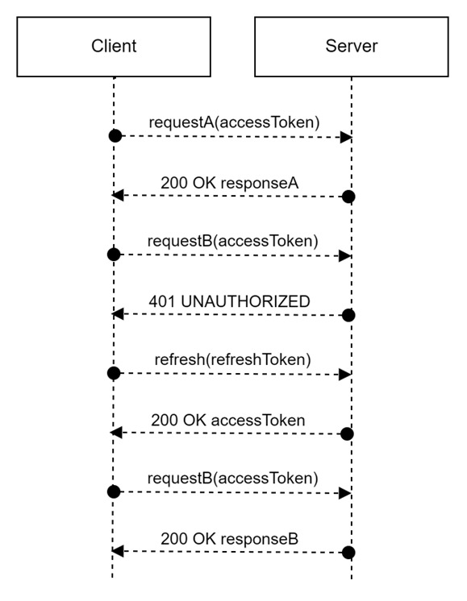
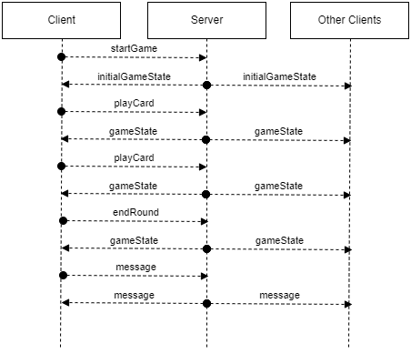
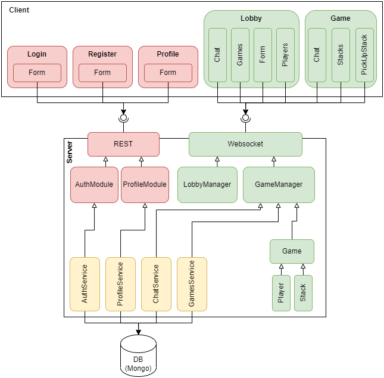
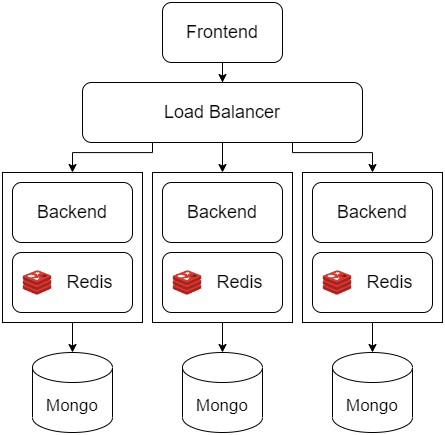

# Dokumentation: The Game

FS 2023, Web Engineering, Fabian Diemand  
Dozent: Ilir Fetai  
Repository: https://git.ffhs.ch/fabian.diemand/webe_the_game/

---

## Inhalt
<!-- TOC -->
* [Dokumentation: The Game](#dokumentation-the-game)
  * [Inhalt](#inhalt)
  * [1 Einleitung](#1-einleitung)
  * [2 Erklärung des Spiels](#2-erklärung-des-spiels)
    * [2.1 Spielaufbau](#21-spielaufbau)
    * [2.2 Ziel des Spiels](#22-ziel-des-spiels)
    * [2.3 Spielregeln](#23-spielregeln)
    * [2.4 Spielregeln "On Fire"](#24-spielregeln-on-fire)
  * [3 Projektplanung](#3-projektplanung)
    * [3.1 Meilenstein 1](#31-meilenstein-1)
    * [3.2 Meilenstein 2](#32-meilenstein-2)
    * [3.3 Meilenstein 3](#33-meilenstein-3)
    * [3.4 Meilenstein 4](#34-meilenstein-4)
  * [4 Anforderungen](#4-anforderungen)
    * [4.1 Funktionale Anforderungen](#41-funktionale-anforderungen)
      * [4.1.1 UC #1 - Registration](#411-uc-1---registration)
      * [4.1.2 UC #2 - Login](#412-uc-2---login)
      * [4.1.3 UC #3 - Spielregeln](#413-uc-3---spielregeln)
      * [4.1.4 UC #4 - Allgemeine Lobby](#414-uc-4---allgemeine-lobby)
      * [4.1.5 UC #5 - Nutzende zu Freundesliste hinzufügen](#415-uc-5---nutzende-zu-freundesliste-hinzufügen)
      * [4.1.6 UC #6 - Nutzende von Freundesliste entfernen](#416-uc-6---nutzende-von-freundesliste-entfernen)
      * [4.1.7 UC #7 - Freunde Lobby](#417-uc-7---freunde-lobby)
      * [4.1.8 UC #8 - Spieltisch](#418-uc-8---spieltisch)
      * [4.1.9 UC #9 - Chatting](#419-uc-9---chatting)
      * [4.1.10 UC #10 - Normales Spiel](#4110-uc-10---normales-spiel)
      * [4.1.11 UC #11 - Spiel "On Fire"](#4111-uc-11---spiel-on-fire)
      * [4.1.12 UC #12 - Schnellinterventionen](#4112-uc-12---schnellinterventionen)
      * [4.1.13 UC #13 - Spielstatistiken](#4113-uc-13---spielstatistiken)
    * [4.2 Nicht-Funktionale Anforderungen](#42-nicht-funktionale-anforderungen)
      * [4.2.1 Leistungsanforderungen](#421-leistungsanforderungen)
      * [4.2.2 Qualitätsanforderungen](#422-qualitätsanforderungen)
      * [4.2.3 Randbedingungen](#423-randbedingungen)
  * [5 Eingesetzte Technologien](#5-eingesetzte-technologien)
    * [5.1 NodeJS (TypeScript)](#51-nodejs-typescript)
    * [5.2 Yarn](#52-yarn-)
    * [5.3 ReactJS (HTML/ CSS/ TypeScript)](#53-reactjs-html-css-typescript)
    * [5.4 Socket.io](#54-socketio)
    * [5.5 MongoDB](#55-mongodb)
    * [5.6 Docker](#56-docker)
    * [5.7 Gitlab](#57-gitlab)
  * [6 Datenmodell](#6-datenmodell)
    * [6.1 User](#61-user)
    * [6.2 Chat (Message)](#62-chat-message)
    * [6.3 Game](#63-game)
      * [6.3.1 Game State](#631-game-state)
      * [6.3.2 Stack](#632-stack)
      * [6.3.3 Player](#633-player)
    * [6.4 Interventions](#64-interventions)
    * [3.5 Ingame Chat](#35-ingame-chat)
  * [7 UI Prototyp](#7-ui-prototyp)
    * [7.1 Landing Page](#71-landing-page)
    * [7.2 Registration Page](#72-registration-page)
    * [7.3 Retrieve Code Page](#73-retrieve-code-page)
    * [7.4 Reset Password Page](#74-reset-password-page)
    * [7.5 Lobby Page](#75-lobby-page)
    * [7.6 Game Page](#76-game-page)
    * [7.7 Profile Page](#77-profile-page)
  * [8 Architekturentscheidungen](#8-architekturentscheidungen)
    * [8.1 Authentifizierungsprotokoll](#81-authentifizierungsprotokoll)
      * [8.1.1 Authentifizierung API](#811-authentifizierung-api)
        * [8.1.1.1 Registration](#8111-registration)
        * [8.1.1.2 Anmeldung](#8112-anmeldung)
        * [8.1.1.3 Passwort zurücksetzen](#8113-passwort-zurücksetzen)
    * [8.2 Kommunikationsprotokoll](#82-kommunikationsprotokoll)
      * [8.2.1 Anmelden von Spielern](#821-anmelden-von-spielern)
      * [8.2.2 Erstellen von Spielen](#822-erstellen-von-spielen)
      * [8.2.3 globale Chatnachrichten](#823-globale-chatnachrichten)
      * [8.2.4 Chatnachrichten im Spiel](#824-chatnachrichten-im-spiel)
      * [8.2.5 Kurzinterventionen während des Spiels](#825-kurzinterventionen-während-des-spiels)
      * [8.2.6 Updates am Spielzustand](#826-updates-am-spielzustand)
        * [8.2.6.1 Starten eines Spiels](#8261-starten-eines-spiels)
        * [8.2.6.2 Legen einer Karte](#8262-legen-einer-karte)
        * [8.2.6.3 Beenden einer Runde](#8263-beenden-einer-runde)
    * [8.3 Gesamtarchitektur](#83-gesamtarchitektur)
  * [9 Deploymentkonzept](#9-deploymentkonzept)
  * [10 Installationsanleitung](#10-installationsanleitung)
    * [10.1 Voraussetzungen](#101-voraussetzungen)
    * [10.2 Installation](#102-installation)
  * [11 Fazit](#11-fazit)
<!-- TOC -->

---

## 1 Einleitung

Das folgende Dokument enthält die Dokumentation der Semesterarbeit im Modul WebE (Web Engineering), des
Frühlingssemesters 2023 an der Fernfachhochschule Schweiz (nachfolgend FFHS). Im Kern geht es dabei um die Umsetzung
einer web-basierten Applikation (fortan Web-App).

## 2 Erklärung des Spiels

Die Web-App wird ein Kartenspiel und ist die Umsetzung des bekannten Kartenspiels **"The Game - Spiel solange du
kannst..."**. Die Spielregeln und der Spielaufbau ergeben sich somit direkt aus jenen
des [realen Kartenspiels](https://www.gamefactory-spiele.com/the-game).

Informationen zum Spiel:

|                |                                     |
|----------------|-------------------------------------|
| Alter          | 8+ Jahre                            |
| Anzahl Spieler | 1 - 5                               |
| Dauer          | 20+ Minuten                         |
| Karten         | 98 Zahlenkarten, Werte von 2 bis 99 |

### 2.1 Spielaufbau

Zu Beginn gibt es vier Einzelkarten (Zielkarten) die auf der Spielfläche liegen und vier Ablegestapel anzeigen. Von den
98 Zahlenkarten erhält jede:r Spieler:in eine gewisse Anzahl verdeckt ausgeteilt. Die Anzahl Handkarten hängt von der
Anzahl Spielender ab (siehe folgende Tabelle). Die verbleibenden Zahlenkarten dienen verdeckt als Nachziehstapel.

| Anzahl Spielender | Anzahl Handkarten pro Spieler:in |
|-------------------|----------------------------------|
| 3, 4, 5           | 6                                |
| 2                 | 7                                |
| 1                 | 8                                |

### 2.2 Ziel des Spiels

Das Spiel basiert auf einem kollaborativen Ansatz. Alle Spieler:innen verfolgen also als Team das Ziel, das Spiel zu
besiegen. Dies ist geschafft, wenn sämtliche 98 Spielkarten auf die vier Ablegestapel abgelegt werden konnten.

### 2.3 Spielregeln

Die Spieler:innen versuchen reihum, ihre Karten auf die Ablegestapel abzulegen. Wichtig ist dabei, dass zwei Stapel
aufsteigend (2 - 100) und zwei Stapel absteigend (99 - 1) bedient werden müssen. Dabei muss die numerische Reihenfolge
der Werte respektiert werden (z.B., auf einem absteigenden Ablagestapel darf keine 55 auf eine 49 gelegt werden).
Solange auf dem Nachziehstapel noch Karten liegen, **müssen** alle Spieler:innen darüber hinaus in jeder Runde zwei
Karten ablegen. Sobald der Nachziehstapel keine Karten mehr enthält, **muss** in jeder Spieler in jeder Runde nur noch
eine Karte ablegen. Jede:r Spieler:in füllt nach dem Ablegen die Handkarten wieder vom Nachziehstapel auf.

Mit dem **Rückwärtstrick** können Kartenstapel gerettet werden. Es ist erlaubt, eine Karte mit einer exakten Differenz
von 10 (nicht 20, 30, etc.), entgegen der Zählrichtung (auf- bzw. absteigend) eines Ablagestapels zu legen. Dadurch wird
der Wert des Stapels wieder um 10 erhöht, bzw. gesenkt und es können mehr Karten abgelegt werden.

### 2.4 Spielregeln "On Fire"

Nebst dem Basisspiel soll auch der Spielmodus "On Fire" spielbar sein. Die Spielkarten mit den Werten **22, 33, 44, 55,
66 und 77** werden speziell gekennzeichnet und mit der Regel versehen, dass sie **zwingend sofort (d.h. vom Spielenden,
oder von der:dem nächsten Spieler:in) überdeckt** werden müssen. Kann das nicht erfüllt werden, ist das Spiel sofort
verloren.

## 3 Projektplanung

### 3.1 Meilenstein 1

**Abgabe: 26.02.2023 (PVA2 - 1d), Nachbearbeitung: 10.03.2023 (PVA3 - 2d)**  
Fokus dieses Meilensteines ist eine möglichst granulare Planung des Endproduktes. Der Programmieraspekt steht hier noch
im Hintergrund. Es sollen sowohl Mockups erstellt und genaue Anforderungen definiert werden. Folgende Punkte sollen in
dem Projektdokument geschildert und in dem Repository in dem Ordner "docs" hinterlegt werden.

- [X] Beschreibung des Ziels des Spieles und der zugehörigen Spielregeln.
- [X] Beschreibung der Anforderungen (Funktional, Nicht-Funktional, KANN, MUSS).
- [X] Präsentation der Anforderungen an die zu entwickelnde Software
- [X] Mockups für das Frontend, sowohl für Desktop als auch für Mobile Devices
- [X] Erste Auflistung der verwendeten Technologien und Bibliotheken
- [X] Kurze Beschreibung des Protokolls zwischen Client und Server
    - Welche Daten werden übertragen
    - Welchem Zweck dient der Austausch
    - Welcher Transportweg wird gewählt (WebSocket oder AJAX)

### 3.2 Meilenstein 2

**Abgabe: 26.03.2023 (PVA4 - 1d), Nachbearbeitung: 07.04.2023 (PVA5 - 2d)**  
Das Frontend, die Einarbeitung des Feedbacks aus dem ersten Meilenstein sowie eine Ausarbeitung der
Kommunikationsstrategie bilden den Fokus dieser Abgabe. Bereits ausprogrammiert soll die Anmeldung durch den Client beim
Server sein, damit die Kommunikation für spätere Schritte bereits gegeben ist. Das Frontend soll, neben der Anmeldung,
bereits grob strukturiert sein, muss allerdings nicht vollständig sein.

- [X] Erweiterung des Kommunikationsschemas (Protokollplanung)
- [X] Anmeldung eines Clients beim Server
- [X] Möglichkeit, Nachrichten vom Client an den Server zu schicken mit angemeldetem Benutzer
- [X] Möglichkeit der Kommunikation unter den Clients
- [X] Grundgerüst Frontend
- [X] Grundgerüst des Servers

### 3.3 Meilenstein 3

**Abgabe: 23.04.2023 (PVA6 - 1d), Nachbearbeitung: 05.05.2023 (PVA7 - 2d)**  
In diesem Schritt werden sowohl Server- als auch Client-Seite weiterentwickelt. Insbesondere über den State der
Applikation sollen die gemachten Gedanken implementiert und ausprogrammiert werden. Die Logik der Applikation oder des
Spiels soll bereits vollständig stehen und programmiert sein. Das Projekt soll also bereits bedienbar sein. Es wird noch
nicht erwartet, dass sämtliche Kontroll- und Speichermechanismen vollständig implementiert sind.

- [X] Verwaltung des State auf dem Client und auf dem Server
- [X] Bedienbare Version des Projektes
- [X] Erweiterte Version des Servers
  - [X] Speicherung der Benutzenden
  - [X] Authentifizierungs-API & Prozesse
  - [X] Password-Änderungs-Mechanik
- [X] Erweiterte Version des Clients
  - [X] Authentifizierung
  - [X] Light- & Dark-Theme Preferences
  - [X] Internationalisierung (DE & EN)
  - [X] Password-Änderung
  - [X] Barebones-UI für Lobby, Spiel und Authentifizierung

### 3.4 Meilenstein 4

**Abgabe: 21.05.2023 (PVA8 - 1d), Nachbearbeitung: 05.06.2023 (PVA9 - 1d)**  
Mit dem Stand dieses Meilensteins muss das Projekt in der nächsten Präsenzveranstaltung präsentiert werden.
Dementsprechend muss die Funktionalität so komplett wie möglich integriert und das Projekt vollständig sein. Nach der
Präsenzveranstaltung werden noch zwei Wochen zur Verfügung gestellt. Dieser Puffer sollte allerdings nicht für fehlende
Features, sondern für Bugfixes und finalisierende Politur des Projektes dienen.

- [X] Feature-complete Version des Servers
  - [X] WebSocket-Interface & Gateway für Spiel, Chatting und Lobby
  - [X] Persistierung von Spielen, Chats und Interventionen
  - [X] Game-Flow management
- [X] Feature-complete Version des Clients
  - [X] Auflistung von offenen Spielen
  - [X] Auflistung von laufenden Spielen
  - [X] Formular für die Erstellung neuer Spiele
  - [X] Spielscreen mit Karten (SVG), Animationen, Drag & Drop
- [X] Kontrolle, ob alle Anforderungen realisiert wurden
- [X] Auflistung, was noch Verbessert werden muss und/oder was noch nicht erledigt wurde
  - [X] Dokumentation abschliessen (insb. Kommunikationsprotokoll & Deploymentkonzept)
  - [X] Out-of-Scope/ Second-Release: Freundeslisten, Spielstatistiken


## 4 Anforderungen

Die Anforderungen an die Web-App ergeben sich aus der Aufgabenstellung im Modulplan der FFHS, den Spielregeln (
vgl. [Abschnitt 2](#2-erklärung-des-spiels)) von "The Game" und Ideen des Entwicklers, welche die Vorgaben ergänzen.

### 4.1 Funktionale Anforderungen

#### 4.1.1 UC #1 - Registration

<table>
  <tr>
    <th>Name</th>
    <td>UC #1 - Registration</td>
  </tr>
  <tr>
    <th>Ziel</th>
    <td>Die Spielenden registrieren sich als Nutzende der Applikation.</td>
  </tr>
  <tr>
    <th>Akteure</th>
    <td>Nutzende</td>
  </tr>
  <tr>
    <th>Vorbedingung</th>
    <td>Nutzende sind nicht bereits registrierte Spielende.</td>
  </tr>
  <tr>
    <th>Auslösendes Ereignis</th>
    <td>Nutzende klicken auf die "Registrieren"-Oberfläche.</td>
  </tr>
  <tr>
    <th>Nachbedingung Normalfall</th>
    <td>Nutzende erhalten eine Erfolgsmeldung im UI.</td>
  </tr>
  <tr>
    <th>Nachbedingung Sonderfall</th>
    <td>
      2a. Fehlende Felder werden gekennzeichnet, Formular wird nicht abgeschlossen
      3a. Invalide Felder werden gekennzeichnet, Formular wird nicht abgeschlossen 
    </td>
  </tr>
  <tr>
    <th>Normalfall</th>
      <td>
        1. Nutzende werden auf die "Registrieren"-Page weitergeleitet <br>
        2. Nutzende geben ihre persönlichen Daten an <br>
        3. Die Daten werden validiert <br>
        4. Für die nutzende Person wird ein Spieler:innen-Profil angelegt <br>
      </td>
  </tr>
  <tr>
    <th>Sonderfall</th>
    <td>
      2a. Nutzende haben nicht alle Daten angegeben <br>
      3a. Die persönlichen Daten der Nutzenden werden als invalide erkannt.
    </td>
  </tr>
</table>

#### 4.1.2 UC #2 - Login

<table>
  <tr>
    <th>Name</th>
    <td>UC #2 - Login</td>
  </tr>
  <tr>
    <th>Ziel</th>
    <td>Registrierte Nutzende können sich einloggen.</td>
  </tr>
  <tr>
    <th>Akteure</th>
    <td>Registrierte Nutzende</td>
  </tr>
  <tr>
    <th>Vorbedingung</th>
    <td>Nutzende haben durch eine Registration bereits ein Profil erhalten.</td>
  </tr>
  <tr>
    <th>Auslösendes Ereignis</th>
    <td>Nutzende klicken auf die "Login"-Oberfläche.</td>
  </tr>
  <tr>
    <th>Nachbedingung Normalfall</th>
    <td>
      Nutzende erhalten eine Erfolgsnachricht, werden eingeloggt und haben nun Zugang zu ihrem
      Profil, sowie zu allen Funktionen des Spiels.
    </td>
  </tr>
  <tr>
    <th>Nachbedingung Sonderfall</th>
    <td>
      2a. Fehlende Felder werden gekennzeichnet, Formular wird nicht abgeschlossen
      4a. Generische Fehlernachricht wird angezeigt 
    </td>
  </tr>
  <tr>
    <th>Normalfall</th>
      <td>
        1. Ein "Login"-Dropdown wird angezeigt <br>
        2. Nutzende geben ihre Authentifikations-Daten (Username, Passwort) an <br>
        3. Nutzende klicken auf "Login"-Knopf <br>
        4. Authentifikations-Daten werden verifiziert <br>
        5. Nutzende werden eingeloggt <br>
      </td>
  </tr>
  <tr>
    <th>Sonderfall</th>
    <td>
      2a. Nutzende füllen nicht alle Felder aus <br>
      4a. Authentifikations-Daten werden als invalide erkannt <br>
    </td>
  </tr>
</table>

#### 4.1.3 UC #3 - Spielregeln

<table>
  <tr>
    <th>Name</th>
    <td>UC #3 - Spielregeln</td>
  </tr>
  <tr>
    <th>Ziel</th>
    <td>Alle Nutzenden (nicht angemeldet, angemeldet) können die Regeln des Spiels einsehen</td>
  </tr>
  <tr>
    <th>Akteure</th>
    <td>Nutzende</td>
  </tr>
  <tr>
    <th>Vorbedingung</th>
    <td>Keine</td>
  </tr>
  <tr>
    <th>Auslösendes Ereignis</th>
    <td>Nutzende klicken auf die "Spielregeln" Schaltfläche.</td>
  </tr>
  <tr>
    <th>Nachbedingung Normalfall</th>
    <td>Keine</td>
  </tr>
  <tr>
    <th>Nachbedingung Sonderfall</th>
    <td>Keine</td>
  </tr>
  <tr>
    <th>Normalfall</th>
    <td>
      1. Spielregeln werden angezeigt <br>
      2. Nutzende lesen Spielregeln <br>
      3. Nutzende verlassen die Spielregeln-Übersicht wieder <br>
    </td>
  </tr>
  <tr>
    <th>Sonderfall</th>
    <td>Keine</td>
  </tr>
</table>

#### 4.1.4 UC #4 - Allgemeine Lobby

<table>
  <tr>
    <th>Name</th>
    <td>UC #4 - Allgemeine Lobby</td>
  </tr>
  <tr>
    <th>Ziel</th>
    <td>Angemeldete Nutzende befinden sich in einer Lobby mit potenziellen Mitspieler:innen auf demselben Server.</td>
  </tr>
  <tr>
    <th>Akteure</th>
    <td>Angemeldete Nutzende</td>
  </tr>
  <tr>
    <th>Vorbedingung</th>
    <td>
      1. Nutzende sind angemeldet <br>
      2. Nutzende befinden sich auf der "Home"-Ansicht des Spiels <br>
      3. Nutzende haben keinen Filter der Übersicht aktiviert <br>
    </td>
  </tr>
  <tr>
    <th>Auslösendes Ereignis</th>
    <td>Keines</td>
  </tr>
  <tr>
    <th>Nachbedingung Normalfall</th>
    <td>
      Nutzende erhalten eine Übersicht aller weiteren Nutzenden, die beim Server angemeldet sind.
    </td>
  </tr>
  <tr>
    <th>Nachbedingung Sonderfall</th>
    <td>
      Eine Meldung über fehlende Mitspieler wird angezeigt und es können nur Einzeltische direkt gestartet werden.
    </td>
  </tr>
  <tr>
    <th>Normalfall</th>
      <td>
        1. Es sind Nutzende beim selben Server angemeldet.
      </td>
  </tr>
  <tr>
    <th>Sonderfall</th>
    <td>
        1a. Es sind keine Nutzenden beim Server angemeldet.
    </td>
  </tr>
</table>

#### 4.1.5 UC #5 - Nutzende zu Freundesliste hinzufügen

<table>
  <tr>
    <th>Name</th>
    <td>UC #5 - Nutzende zu Freundesliste hinzufügen</td>
  </tr>
  <tr>
    <th>Ziel</th>
    <td>Nutzende können sich gegenseitig in Freundeslisten verwalten.</td>
  </tr>
  <tr>
    <th>Akteure</th>
    <td>Sender:in (Nutzende:r), Empfänger:in (Nutzende:r)</td>
  </tr>
  <tr>
    <th>Vorbedingung</th>
    <td>Akteure sind angemeldet.</td>
  </tr>
  <tr>
    <th>Auslösendes Ereignis</th>
    <td>Sender:in will Empfänger:in zur Freundesliste hinzufügen.</td>
  </tr>
  <tr>
    <th>Nachbedingung Normalfall</th>
    <td>Sender:in und Empfänger:in werden zur gegenseitigen Freundesliste hinzugefügt.</td>
  </tr>
  <tr>
    <th>Nachbedingung Sonderfall</th>
    <td>
        3a. Empfänger:in erhält keine Anfrage <br>
        4a. Empfänger:in erhält Anfrage beim nächsten Login <br>
        5a. Empfänger:in wird nicht zur Freundesliste hinzugefügt <br>
    </td>
  </tr>
  <tr>
    <th>Normalfall</th>
      <td>
        1. Sender:in wählt Empfänger:in aus der Liste der Nutzenden aus <br>
        2. Sender:in klickt die "Zur Freundesliste einladen"-Oberfläche <br>
        3. Sender:in bestätigt im folgenden Pop-Up die Anfrage <br>
        4. Anfrage wird an den:die Empfänger:in geschickt <br>
        5. Empfänger:in bestätigt Anfrage <br>
      </td>
  </tr>
  <tr>
    <th>Sonderfall</th>
    <td>
        3a. Sender:in bricht die Aktion im Pop-Up ab <br>
        4a. Empfänger:in geht Offline <br>
        5a. Empfänger:in lehnt Anfrage ab <br>
        5b. Sender:in erhält die Information über die Ablehnung <br>
    </td>
  </tr>
</table>

#### 4.1.6 UC #6 - Nutzende von Freundesliste entfernen

<table>
  <tr>
    <th>Name</th>
    <td>UC #6 - Nutzende von Freundesliste entfernen</td>
  </tr>
  <tr>
    <th>Ziel</th>
    <td>Nutzende können sich aus Freundeslisten entfernen.</td>
  </tr>
  <tr>
    <th>Akteure</th>
    <td>Nutzende</td>
  </tr>
  <tr>
    <th>Vorbedingung</th>
    <td>Akteure sind angemeldet.</td>
  </tr>
  <tr>
    <th>Auslösendes Ereignis</th>
    <td>Nutzende:r will sich aus einer Freundesliste entfernen.</td>
  </tr>
  <tr>
    <th>Nachbedingung Normalfall</th>
    <td>
        Nutzer:in und Gegenüber wurden aus der jeweils anderen Freundesliste entfernt.
    </td>
  </tr>
  <tr>
    <th>Nachbedingung Sonderfall</th>
    <td>
        Freundeslisten verbleiben unverändert. Keine Nachricht an Gegenüber.
    </td>
  </tr>
  <tr>
    <th>Normalfall</th>
      <td>
        1. Nutzende:r sucht die entsprechende Person in der eigenen Freundesliste <br>
        2. Nutzende:r klickt die "Aus Freundesliste entfernen"-Oberfläche <br>
        3. Nutzende:r bestätigt im Pop-Up die Aktion <br>
        4. Gegenseite erhält die entsprechende Information <br>
      </td>
  </tr>
  <tr>
    <th>Sonderfall</th>
    <td>
        3a. Nutzende:r bricht die Aktion ab.
    </td>
  </tr>
</table>

#### 4.1.7 UC #7 - Freunde Lobby

<table>
  <tr>
    <th>Name</th>
    <td>UC #7 - Freunde Lobby</td>
  </tr>
  <tr>
    <th>Ziel</th>
    <td>Nutzende von der Freundesliste sind in einer eigenen Lobby einsehbar.</td>
  </tr>
  <tr>
    <th>Akteure</th>
    <td>Nutzende</td>
  </tr>
  <tr>
    <th>Vorbedingung</th>
    <td>Nutzende sind eingeloggt.</td>
  </tr>
  <tr>
    <th>Auslösendes Ereignis</th>
    <td>Nutzende wollen "The Game" spielen.</td>
  </tr>
  <tr>
    <th>Nachbedingung Normalfall</th>
    <td>
        Die Übersicht zeigt alle eingeloggten Nutzenden, die auch auf der Freundesliste sind. <br>
    </td>
  </tr>
  <tr>
    <th>Nachbedingung Sonderfall</th>
    <td>
        Der:die Nutzende erhält eine entsprechende Nachricht in der leeren Übersicht. <br>
    </td>
  </tr>
  <tr>
    <th>Normalfall</th>
    <td>
        1. Angemeldete Nutzende sehen eine Übersicht eingeloggten Nutzenden auf der Freundesliste <br>
    </td>
  </tr>
  <tr>
    <th>Sonderfall</th>
    <td>
        1a.1. Keine Nutzenden auf der Freundesliste sind angemeldet. <br>
        1a.2. Die Freundesliste ist leer.
    </td>
  </tr>
</table>

#### 4.1.8 UC #8 - Spieltisch

<table>
  <tr>
    <th>Name</th>
    <td>UC #8 - Spieltisch</td>
  </tr>
  <tr>
    <th>Ziel</th>
    <td>Nutzende können Spieltische für eine bestimmte Anzahl Mitspielender und einen der beiden Modi kreieren.</td>
  </tr>
  <tr>
    <th>Akteure</th>
    <td>Nutzende</td>
  </tr>
  <tr>
    <th>Vorbedingung</th>
    <td>Nutzende sind angemeldet.</td>
  </tr>
  <tr>
    <th>Auslösendes Ereignis</th>
    <td>Nutzende wollen eine Runde "The Game" spielen.</td>
  </tr>
  <tr>
    <th>Nachbedingung Normalfall</th>
    <td>
        Tisch mit der entsprechenden Konfiguration wurde erstellt.
    </td>
  </tr>
  <tr>
    <th>Nachbedingung Sonderfall</th>
    <td>Keine.</td>
  </tr>
  <tr>
    <th>Normalfall</th>
    <td>
        1. Nutzende klicken die "Tisch erstellen"-Oberfläche <br>
        2. Nutzende geben die Anzahl Spielender an (1-5) <br>
        3. Nutzende geben den Spielmodus an (Classic/ On Fire) <br>
        4. Nutzende geben Einschränkungen an (offen/ nur Freundesliste) <br>
        5. Nutzende klicken "Fertigstellen" <br>
    </td>
  </tr>
  <tr>
    <th>Sonderfall</th>
    <td>Keiner.</td>
  </tr>
</table>

#### 4.1.9 UC #9 - Chatting

<table>
  <tr>
    <th>Name</th>
    <td>UC #9 - Chatting</td>
  </tr>
  <tr>
    <th>Ziel</th>
    <td>Nutzende können sich über eine Chatfunktion in verschiedenen Modi austauschen.</td>
  </tr>
  <tr>
    <th>Akteure</th>
    <td>Nutzende</td>
  </tr>
  <tr>
    <th>Vorbedingung</th>
    <td>Nutzende sind angemeldet.</td>
  </tr>
  <tr>
    <th>Auslösendes Ereignis</th>
    <td>Nutzende wollen sich mit anderen Nutzenden austauschen.</td>
  </tr>
  <tr>
    <th>Nachbedingung Normalfall</th>
    <td>
        Empfänger:innen erhalten die Nachricht.
    </td>
  </tr>
  <tr>
    <th>Nachbedingung Sonderfall</th>
    <td>
        2a. Empfänger:in erhält Nachricht beim nächsten Login <br>
        3a. "Senden"-Knopf kann nicht geklickt werden.
    </td>
  </tr>
  <tr>
    <th>Normalfall</th>
    <td>
        1. Nutzende wählen im Chat-Fenster den gewünschten Pool (Flüstern, Freunde, gesamte Lobby) <br>
        2. (Falls Flüstern) Nutzende taggen eine:n andere:n eingeloggte:n Nutzende:n <br>
        3. Nutzende verfassen eine Nachricht und versenden diese <br>
    </td>
  </tr>
  <tr>
    <th>Sonderfall</th>
    <td>
        2a. Empfänger:in loggt sich aus <br>
        3a. Nutzende verfassen keine Nachricht
    </td>
  </tr>
</table>

#### 4.1.10 UC #10 - Normales Spiel

<table>
  <tr>
    <th>Name</th>
    <td>UC #10 - Normales Spiel</td>
  </tr>
  <tr>
    <th>Ziel</th>
    <td>Nutzende können das Spiel im klassischen Modus spielen.</td>
  </tr>
  <tr>
    <th>Akteure</th>
    <td>Nutzende</td>
  </tr>
  <tr>
    <th>Vorbedingung</th>
    <td>Nutzende wollen eine Spielrunde im klassischen Modus spielen.</td>
  </tr>
  <tr>
    <th>Auslösendes Ereignis</th>
    <td>Nutzende erstellen einen Tisch für den klassischen Spielmodus</td>
  </tr>
  <tr>
    <th>Nachbedingung Normalfall</th>
    <td>
        Es gibt im Spiel keine Spezialkarten und Regeln.
    </td>
  </tr>
  <tr>
    <th>Nachbedingung Sonderfall</th>
    <td>Keine.</td>
  </tr>
  <tr>
    <th>Normalfall</th>
    <td>
        1. An einem Tisch im klassischen Modus wird ein Spiel gestartet <br>
        2. Das Spiel kann entsprechend der Regeln im klassischen Modus gespielt werden <br>
    </td>
  </tr>
  <tr>
    <th>Sonderfall</th>
    <td>Keiner.</td>
  </tr>
</table>

#### 4.1.11 UC #11 - Spiel "On Fire"

<table>
  <tr>
    <th>Name</th>
    <td>UC #11 - Spiel "On Fire"</td>
  </tr>
  <tr>
    <th>Ziel</th>
    <td>Nutzende können das Spiel im "On Fire" Modus spielen.</td>
  </tr>
  <tr>
    <th>Akteure</th>
    <td>Nutzende</td>
  </tr>
  <tr>
    <th>Vorbedingung</th>
    <td>Nutzende wollen eine Spielrunde im "On Fire"-Modus spielen.</td>
  </tr>
  <tr>
    <th>Auslösendes Ereignis</th>
    <td>Nutzende erstellen einen Tisch für den "On Fire"-Spielmodus.</td>
  </tr>
  <tr>
    <th>Nachbedingung Normalfall</th>
    <td>Das Spiel wird analog der Regeln des "On Fire" Modus gespielt.</td>
  </tr>
  <tr>
    <th>Nachbedingung Sonderfall</th>
    <td>Keine.</td>
  </tr>
  <tr>
    <th>Normalfall</th>
      <td>
        1. An einem Tisch im "On Fire"-Modus wird ein Spiel gestartet <br>
        2. Das Spiel kann entsprechend der Regeln im "On Fire"-Modus gespielt werden <br>
      </td>
  </tr>
  <tr>
    <th>Sonderfall</th>
    <td>Keiner.</td>
  </tr>
</table>

#### 4.1.12 UC #12 - Schnellinterventionen

<table>
  <tr>
    <th>Name</th>
    <td>UC #12 - Schnellinterventionen</td>
  </tr>
  <tr>
    <th>Ziel</th>
    <td>Die Kommunikation während des Spiels kann durch Schnellinterventionen verbessert werden.</td>
  </tr>
  <tr>
    <th>Akteure</th>
    <td>Nutzende</td>
  </tr>
  <tr>
    <th>Vorbedingung</th>
    <td>Ein Spiel wurde gestartet.</td>
  </tr>
  <tr>
    <th>Auslösendes Ereignis</th>
    <td>Akteure möchten bestimmte Aktionen schnell kommunizieren.</td>
  </tr>
  <tr>
    <th>Nachbedingung Normalfall</th>
    <td>
        Beim betroffenen Stapel wird die Aktion angezeigt, die ein anderer Nutzer geklickt hat.
    </td>
  </tr>
  <tr>
    <th>Nachbedingung Sonderfall</th>
    <td>Keine.</td>
  </tr>
  <tr>
    <th>Normalfall</th>
      <td>
        1. Nutzende stellen fest, dass ein Rückwärtstrick möglich wäre, oder dass sie Karten in der Nähe eines Stapels auf der Hand haben <br>
        2. Nutzende klicken beim entsprechenden Stapel auf die Oberfläche um die Information schnell anzubringen <br>
      </td>
  </tr>
  <tr>
    <th>Sonderfall</th>
    <td>Keiner.</td>
  </tr>
</table>

#### 4.1.13 UC #13 - Spielstatistiken

<table>
  <tr>
    <th>Name</th>
    <td>UC #13 - Spielstatistiken</td>
  </tr>
  <tr>
    <th>Ziel</th>
    <td>Nutzende können bestimmte Metriken in ihren Profilen tracken.</td>
  </tr>
  <tr>
    <th>Akteure</th>
    <td>Nutzende</td>
  </tr>
  <tr>
    <th>Vorbedingung</th>
    <td>Nutzende haben ein Profil und sind angemeldet.</td>
  </tr>
  <tr>
    <th>Auslösendes Ereignis</th>
    <td>Nutzende wollen Statistiken über ihre Spiele sehen.</td>
  </tr>
  <tr>
    <th>Nachbedingung Normalfall</th>
    <td>
        Nutzende sehen Metriken wie die Anzahl gespielter Spiele, die Anzahl gewonnener Spiele, die durchschnittliche Dauer eines Spiels.
    </td>
  </tr>
  <tr>
    <th>Nachbedingung Sonderfall</th>
    <td>
        Nutzende werden auf den Umstand der fehlenden Statistiken hingewiesen.
    </td>
  </tr>
  <tr>
    <th>Normalfall</th>
      <td>
        1. Nutzende klicken auf das "Profil"-Icon
        2. Nutzende wechseln auf die "Statistiken"-Ansicht
      </td>
  </tr>
  <tr>
    <th>Sonderfall</th>
    <td>
        2a. Es sind keine Spielstatistiken vorhanden (z.B. keine Spiele gespielt)
    </td>
  </tr>
</table>

### 4.2 Nicht-Funktionale Anforderungen

#### 4.2.1 Leistungsanforderungen
| Titel                      | Art  | Beschreibung                                                                                                                                  | Metrik                                          |
|----------------------------|------|-----------------------------------------------------------------------------------------------------------------------------------------------|-------------------------------------------------|
| Spielrunden Nachvollziehen | Muss | Spielrunden sind bis auf Spielrunden-Ebene nachvollziehbar                                                                                    | Ja/ Nein                                        |
| Echtzeit-Kommunikation     | Muss | Kommunikation zwischen den Spielern während der Runde erfolgt in Echtzeit und beeinträchtigt den Spielfluss nicht                             | < 100 Millisekunden zwischen Sender & Empfänger |
| Spielstatistiken           | Soll | Statistiken (Anzahl gespielter Spiele, Anzahl gewonnener Spiele, durchschnittliche Rundendauer) werden unmittelbar nach Spielende nachgeführt | < 200 Sekunden bis Update in UI                 |

#### 4.2.2 Qualitätsanforderungen
| Titel                       | Art  | Beschreibung                                                                                   | Metrik                                   |
|-----------------------------|------|------------------------------------------------------------------------------------------------|------------------------------------------|
| Server-Client-Kommunikation | Muss | Der Datenaustausch zwischen Client und Server ist über ein Kommunikationsprotokoll geregelt    | Kein Austausch ausserhalb des Protokolls |
| Responsive Frontend         | Muss | Das Frontend der Web-App ist responsiv (Desktop, Mobile)                                       | Ja/ Nein                                 |
| Aktionslogik im Backend     | Muss | Die Logik aller Spielzüge und die Zustandsgenerierung erfolgt im Backend                       | Ja/ Nein                                 |
| Light- & Dark-Mode          | Soll | Das Frontend unterstützt zwei Darstellungsmodi, unabhängig von der Konstellation der Nutzenden | Ja/ Nein                                 |

#### 4.2.3 Randbedingungen
| Titel                 | Art  | Beschreibung                                                                                                           | Metrik   |
|-----------------------|------|------------------------------------------------------------------------------------------------------------------------|----------|
| Internationalisierung | Muss | Sämtliche Texte im Frontend sind auf Englisch und Deutsch verfügbar                                                    | Ja/ Nein |  
| Persistenz            | Muss | Das Backend hat einen Persistenz-Layer (Nachvollziehbarkeit von Spielrunden, Statistiken, Profil-Daten, Freundeslisten | Ja/ Nein |

## 5 Eingesetzte Technologien
### 5.1 NodeJS (TypeScript)
[NodeJS](https://nodejs.org/en/) ist eine JavaScript-Laufzeitumgebung, welche Plattformneutral und Open-Source ist. Durch den extrem schlanken Kern, die grosse Modularität,
die Möglichkeit der asynchronen Programmierung trotz der single-threat Natur von NodeJS und letztlich der extrem grossen Community,
eignet sich NodeJS für eine Vielzahl von unterschiedlichen Anwendungen.
Obwohl in NodeJS grundsätzlich JavaScript verwendet wird, wird für die Umsetzung dieses Projekts TypeScript verwendet. TypeScript führt einige Konzepte
wie Typsicherheit, Klassenstrukturen und Vererbung ein, die zur Entwicklungszeit grosse Vorteile und Sicherheiten bieten. Der in TypeScript verfasste Code
wird vor der Laufzeit in JavaScript Code kompiliert. Letztlich läuft in der Laufzeitumgebung folglich wieder JavaScript und TypeScript existiert nur zur Entwicklungszeit.

Für das Projekt wird NodeJS in der LTS-Version 18.14.2 verwendet. Ausserdem wird entsprechend dem JavaScript Standard ES13 ([ECMAScript 13/ 2022](https://www.ecma-international.org/wp-content/uploads/ECMA-262_13th_edition_june_2022.pdf)) entwickelt.

### 5.2 Yarn 
[Yarn](https://yarnpkg.com/) ist ein Package-Manager für Nodejs und bietet hinsichtlich Security und Geschwindigkeit einige Vorteile gegenüber dem klassischen
Node Package Manager (NPM), der mit Node mitgeliefert wird. So werden unter anderem Lizenzen automatisch geprüft und kann Dependencies parallel installieren. 
Für diese Vorteile wird der Mehraufwand hinsichtlich Speicherplatz in Kauf genommen.

Für das Projekt wird Yarn in der Version 1.22.19 (Classic Stable) verwendet.

### 5.3 ReactJS (HTML/ CSS/ TypeScript)
[ReactJS](https://reactjs.org/) ist eine Bibliothek zur Erstellung von webbasierten UIs. Ein spezielles Merkmal der Library ist die komponentenbasierte Herangehensweise an
die Erstellung einer grafischen Benutzeroberfläche. So können repetitive Muster sehr effizient und effektiv umgesetzt und gewartet werden.

Der Autor ist sich zum aktuellen Zeitpunkt noch unsicher, ob React zum Einsatz kommen wird. 
Sollte React für das Frontend verwendet werden, würden nebst HTML und CSS wiederum TypeScript zum Einsatz kommen. Die Entscheidung
ist im Abschnitt [5.1 NodeJS](#51-nodejs-typescript) erklärt. Für das Projekt würde React 18 verwendet werden.

### 5.4 Socket.io
Für die Echtzeitkommunikation zwischen Server(n) und Webclients kommt [Socket.io](https://socket.io/) zum Einsatz. Socket.IO nutzt das [WebSocket Protokoll](https://en.wikipedia.org/wiki/WebSocket), um eine bidirektionale, nahezu verzögerungsfreie Verbindung 
zwischen Server und Client aufzubauen. Zusätzliche Funktionalitäten wie HTTP long-polling (Server schickt Response erst, wenn Daten vorhanden sind) als Fallback zur regulären WebSocket-Verbindung, automatisches Wiederherstellen der Verbindung nach Unterbrüchen, Pufferung von 
Datenpaketen und der Möglichkeit, Acknowledgments zu senden, eignet sich Socket.io bestens zur Verwendung im Projekt.

Im Projekt wird die aktuellste Version von Socket.io gemäss [npmjs.com](https://www.npmjs.com/package/socket.io) verwendet (z.Z. 4.6.1)

### 5.5 MongoDB
Die Persistenz im Projekt wird mit [MongoDB](https://www.mongodb.com/) umgesetzt. MongoDB ist eine NoSQL Dokumentdatenbank, die sehr oft für Web Development verwendet wird.
Datensätze werden als Dokumente (in unserem Fall in JSON) abgelegt. Sammlungen von Dokumenten werden Collections genannt (z.B. Players-Collection, mit einzelnen Player-Documents).
Aufgrund der hohen Flexibilität, Skalierbarkeit und Einfachheit in der Anwendung wird für das Projekt eine NoSQL Datenbank verwendet.

Da MongoDB mit [Mongo Atlas](https://www.mongodb.com/atlas/database) kostenfrei (begrenzt) eine Cloud-Datenbank zur Verfügung stellt 
und der Autor bereits Erfahrung mit deren Verwendung hat, fällt die Wahl auf das Produkt.

### 5.6 Docker
Mindestens im Rahmen des Deploymentkonzepts wird Containerisierung eine Rolle spielen. Dafür wird auf [Docker](https://www.docker.com/) gesetzt. Containerisierung
erlaubt, das Deployment von Applikationen unabhängig von der Infrastruktur, da die Applikation mit sämtlichen Abhängigkeiten (Libraries, Files, Konfigurationen) 
geliefert wird und somit im Idealfall keine Konfiguration der Infrastruktur mehr notwendig ist.

Ausserdem können mit diesem Prozess sehr einfach Replikate erstellt werden, wodurch eine unkomplizierte Skalierung (z.B. mit [Kubernetes](https://kubernetes.io/)) erst möglich wird.
Nähere Details zum Deploymentkonzept werden zu einem späteren Zeitpunkt im Rahmen des entsprechenden Auftrags erarbeitet.

### 5.7 Gitlab
Für die Source-Code-Verwaltung und die Versionierung wird GitLab verwendet. Innerhalb von Gitlab werden insbesondere Issues verwendet,
um User Stories und Tasks zu erfassen. Zu Planungszwecken wird ausserdem ein Board mit den Phasen "Backlog", "Sprint Backlog", "Development",
"Verification" und "Done" erstellt. Die Branch-Strategie folgt grundsätzlich den Empfehlungen des Git-flow-Workflow.

## 6 Datenmodell
### 6.1 User

```json
{
  "uid": <unique identifier>,
  "firstname": <first name of the user>,
  "lastname": <last name of the user>,
  "username": <pseudonym username>,
  "email": <email of the user>,
  "password": <password of the user>,
  "profile_picture": <profile picture of the user>,
  "friend_list": <list of user-ids>
  
  "games_data": {
    "played": <#of games played>,
    "wins": <#of games won>,
    "defeats": <#of games lost>,
    "avg_duration": <average game duration>,
    "partners": <list of prev partners (max. 30 rounds)>
  }
}
```

### 6.2 Chat (Message)
```json
{
  "uid": <unique identifier>,
  "authorUid": <uid of the author>,
  "authorName": <name of the author>,
  "message": <message content>,
  "timestamp": <timestamp of the message>
}
```

### 6.3 Game
#### 6.3.1 Game State
```json
{
  "gameId": <unique identifier>,
  "creator": <uid of the creator>,
  "numberOfPlayers": <# of players intended for the game>,
  "gameMode": <game mode (classic, onfire)>,
  "numberOfHandcards": <# of handcards per player>,
  "progress": <game progress (open, started, won, lost)>,
  "pickupStack": <list of cards in the pickup stack>,
  "stacks": <list of stacks (stacks to play cards onto, during the game)>,
  "roundCounter": <# of rounds played>,
  "canRoundEnd": <boolean, whether the round can end>,
  "isNewRound": <boolean, whether a the round has just started>,
  "cardsLaidInRound": <# of cards laid in the current round>,
  "dangerRound": <boolean, whether the current round is a danger round>,
  "players": <list of players>,  
}
```

#### 6.3.2 Stack
```json
{
  "id": <number of the stack (0 - 3)>,
  "direction": <direction of the stack (upward, downward)>,
  "cards": <list of cards in the stack>
}
```

#### 6.3.3 Player
```json
{
  "uid": <unique identifier>,
  "username": <username of the player>,
  "handCards": <list of cards the player has on hand>,
}
```

### 6.4 Interventions
```json
{
  "uid": <unique identifier>,
  "gameUid": <gameUid of the game the intervention is related to>,
  "playerUid": <uid of the player the intervention is related to>,
  "playerName": <name of the player the intervention is related to>,
  "stackIndex": <index of the stack the intention is related to>,
  "timestamp": <timestamp of the intervention>,
  "type": <type of the message (chat, intervention)>
}
```

### 3.5 Ingame Chat
```json
{
  "uid": <unique identifier>,
  "gameUid": <gameUid of the game the message is related to>,
  "authorUid": <uid of the author>,
  "authorName": <name of the author>,
  "message": <message content>,
  "timestamp": <timestamp of the message>,
  "type": <type of the message (chat, intervention)>
}
```


## 7 UI Prototyp
Der UI/UX Prototyp wurde mit Figma erstellt. Die folgenden Abschnitte zeigen die Screens.  
Link zum interaktiven Prototypen: [Figma](https://www.figma.com/proto/hoWQ9phvgjPlq5waB3pztI/UI-Prototype?page-id=0%3A1&node-id=73-862&viewport=-1118%2C331%2C0.18&scaling=contain&starting-point-node-id=44%3A468&show-proto-sidebar=1)

### 7.1 Landing Page


### 7.2 Registration Page


### 7.3 Retrieve Code Page


### 7.4 Reset Password Page


### 7.5 Lobby Page


### 7.6 Game Page


### 7.7 Profile Page


## 8 Architekturentscheidungen

### 8.1 Authentifizierungsprotokoll

#### 8.1.1 Authentifizierung API
Serverseitig werden folgende Endpunkte für die Authentifizierung bereitgestellt:
- POST /auth/register (Registrierung eines neuen Benutzers)
- POST /auth/signin (Anmeldung eines registrierten Benutzers)
- POST /auth/signout (Abmeldung eines registrierten Benutzers)
- POST /auth/refresh (Erneuerung des JWT Access Tokens)
- POST /auth/request-token (Anfordern einer E-Mail mit einem Token zur Passwortänderung)
- POST /auth/reset-password (Passwortänderung)

Die Erneuerung des Tokens wird durch einen Refresh Token realisiert. Dieser wird bei der Anmeldung mit ausgeliefert und
ist 7 Tage gültig. Der Access Token ist 15 Minuten gültig. Wird ein neuer Access Token angefordert, wird der Refresh
Token überprüft. Ist dieser gültig, wird ein neuer Access Token ausgestellt. Ist der Refresh Token abgelaufen, muss sich
der Benutzer erneut anmelden. Das folgende Diagramm zeigt diesen Prozess:


##### 8.1.1.1 Registration
Bei der Registration wird ein neuer Benutzer angelegt. Das Passwort wird mit bcrypt gehasht und in der Datenbank gespeichert.
Sämtliche Daten der Registrierung werden vom Client, vom Server und von der Datenbank überprüft. So werden 
Schema-Inkonsistenzen in jedem Layer vermieden.
Das erwartete DTO hat folgende Struktur:
```json
{
  "firstname": <Vorname des Benutzers>,
  "lastname": <Nachname des Benutzers>,
  "username": <Benutzername>,
  "email": <E-Mail des Benutzers>,
  "password": <Passwort des Benutzers>,
  "confirmationPassword": <Passwort des Benutzers zur Bestätigung>,
  "language": <Sprache des Benutzers>,
  "theme": <Theme des Benutzers>,
  "profilePicture": <Profilbild des Benutzers>
}
```

##### 8.1.1.2 Anmeldung
Bei der Anmeldung wird der Benutzer anhand seiner E-Mail-Adresse und seines Passworts authentifiziert. Das Passwort wird mit bcrypt
gehasht und mit dem gespeicherten Hash verglichen. Ist die Authentifizierung erfolgreich, wird ein JWT Access Token und ein JWT Refresh Token
erzeugt und an den Client zurückgegeben. Die Tokens werden mit Hilfe von JSON Web Tokens (JWT) erzeugt. Die Tokens werden mit einer
Signatur (Secret) versehen, die nur der Server kennt. So kann der Server die Authentizität der Tokens überprüfen. Sowohl der Access Token, als auch der
Refresh Token haben eine Gültigkeit. Während die Gültigkeit grundsätzlich beliebig im .env File spezifiziert werden kann, empfiehlt der Autor
eine Gültigkeit von 15 Minuten für den Access Token und von sieben Tagen für den Refresh Token.

Ein Login-Request hat folgende Struktur:
```json
{
  "email": <E-Mail des Benutzers>,
  "password": <Passwort des Benutzers>
}
```

Die Login-Response hat folgende Struktur:
```json
{
  "uid": <User ID des angemeldeten Benutzers>,
  "accessToken": <JWT-Access Token mit einer Gültigkeit von 15 Minuten>,
  "refreshToken" <JWT-Refresh Token mit einer Gültigkeit von 7 Tagen>
}
```
Fehler werden entsprechend ihrer Ursache mit einem HTTP Status Code (400 oder 401) und einer Fehlermeldung zurückgegeben:
```json
{
  "status": <HTTP Status Code>,
  "message": <Fehlermeldung>
}
```

Der Browser speichert die Token im Localstorage. Der Access Token wird bei jeder Anfrage an den Server mitgeschickt. Der Refresh Token wird
nur bei der Anfrage zum Erneuern des Access Tokens mitgeschickt. Client-seitig werden Requests an den Server mit Axios durchgeführt. Mit Interceptors wird
dabei der Authorization-Header automatisch gesetzt und bei Bedarf der Access Token erneuert.
Die Erneuerung des Access Tokens erfordert folgende Struktur:
```json
{
  "uid": <User ID des angemeldeten Benutzers>,
  "refreshToken": <JWT-Refresh Token>
}
```

##### 8.1.1.3 Passwort zurücksetzen
Der Client hat die Möglichkeit, sein Passwort zurückzusetzen. Dazu muss er eine E-Mail-Adresse und einen Usernamen angeben, die mit seinem Account verknüpft sind.
Der Server prüft, ob die E-Mail-Adresse und der Username mit einem Account verknüpft sind. Ist dies der Fall, wird ein Token erzeugt und an die E-Mail-Adresse
des Benutzers gesendet. Der Token wird in der Datenbank gespeichert und hat eine Gültigkeit von 60 Minuten. Der Client kann nun das Passwort zurücksetzen.
Der Request-Body für die Anforderung des Reset-Tokens hat folgende Struktur:
```json
{
  "email": <E-Mail des Benutzers>,
  "username": <Username des Benutzers>
}
```

Mit dem Token kann das Passwort vom Client zurückgesetzt werden.
Der Request-Body für das Zurücksetzen des Passworts hat folgende Struktur:
```json
{
  "token": <Token, das an die E-Mail-Adresse des Benutzers gesendet wurde>,
  "password": <Neues Passwort des Benutzers>,
  "confirmationPassword": <Neues Passwort des Benutzers zur Bestätigung>
}
```

### 8.2 Kommunikationsprotokoll
Dieser Abschnitt stellt das Kommunikationsprotokoll via Websocket vor. Für die Kommunikation über den Websocket gibt es 
folgende wichtige Anwendungsfälle: Anmelden von Spielern, Erstellen von Spielen, globale Chatnachrichten, Chatnachrichten im Spiel,
Updates am Spielzustand (legen von Karten), Kurzinterventionen während des Spiels. 

Die Datenobjekte für den Nachrichtenaustausch, sowie die Event-Typen sind im geteilten Modul "common" definiert.

#### 8.2.1 Anmelden von Spielern
Wenn sich ein Spieler neu im Webgame einloggt und dadurch der Lobby beitritt, meldet sich dessen Client beim Websocket an.
Dafür wird eine Anmeldenachricht mit folgender Struktur an den Websocket geschickt:
```json
{
  "uid": <User ID des angemeldeten Benutzers>,
  "username": <Username des angemeldeten Benutzers>,
}
```

Diese Anmeldung hat nichts mehr mit der Authentifikation des Benutzers zu tun, sondern dient ledigtlich des Aufbaus der Websocket-Verbindung.
Zusätzlich werden alle ebenfalls verbundenen Benutzer über den neuen Spieler über eine Websocket-Nachricht informiert und deren GUI wird entsprechend angepasst.
Das Update trägt den Event Typ NEW_PLAYER. Der neue Spieler erhält als Reaktion auf die Anmeldung eine Nachricht mit allen bereits angemeldeten Spielern und dem Event-Typ PLAYERS_UPDATE.

#### 8.2.2 Erstellen von Spielen
Wird in der GUI ein neues Spiel erstellt, wird das neue Spiel dem Server mit folgender Struktur mitgeteilt:
```json
{
  "creator": <User ID des Spielers, der das Spiel erstellt hat>,
  "mode": <Spielmodus (classic, onfire>,
  "numberOfPlayers": <Anzahl Spieler>,
}

Der Server erstellt ein neues Spiel und informiert alle verbundenen Spieler über das neue Spiel. Das Update trägt den Event Typ CREATE_GAME.
Das Update hat zusätzlich zu den Attributen aus der vorherigen Strtuktur folgende Attribute:
```json
{
  ...: <Attribute der vorherigen Struktur (Erstellung eines Spiels)>,
  "uid": <ID des Spiels>,
  "connectedPlayers": <Liste der verbundenen Spieler>,
  "started": <Boolean, ob das Spiel bereits gestartet wurde>,
}
```

Wenn der Spieler sich neu beim Server anmeldet (vgl. 8.2.1), erhält er eine Liste aller Spiele. Daher ist das "started"-Attribut relevant.

#### 8.2.3 globale Chatnachrichten
Eine globale Chatnachricht (Nachricht an alle Spieler) hat folgende Struktur:
```json
{
  "authorUid": <User ID des Autors>,
  "authorName": <Username des Autors>,
  "message": <Nachricht>,
  "timestamp": <Zeitstempel der Nachricht>,
}
```

Die Nachricht wird vom Server an alle verbundenen Spieler gesendet. 
Wenn sich ein Spieler neu beim Server anmeldet, erhält er ausserdem eine Liste der letzten 300 Nachrichten. 


#### 8.2.4 Chatnachrichten im Spiel
Chatnachrichten im Spiel folgen der selben Struktur wie globale Nachrichten, haben allerdings zusätzlich noch folgende Attribute:

```json
{
  ...: <Attribute der vorherigen Struktur (globaler Chat)>,
  "gameUid": <ID des Spiels, in dem die Nachricht gesendet wurde>,
  "type": <Typ der Nachricht (chat, intervention)>,
}
```

#### 8.2.5 Kurzinterventionen während des Spiels
Kurzinterventionen während des Spiels haben dieselbe Struktur wie Chatnachrichten und unterscheiden sich lediglich durch das "type"-Attribut und
den Inhalt der Nachricht.

#### 8.2.6 Updates am Spielzustand
Updates am Spielzustand können durch verschiedene Aktionen ausgelöst werden. Dazu gehören das Starten eines Spiels, das Legen einer Karte und das Beenden einer Runde.
Das Update hat dabei immer folgende Struktur:

```json
{
  "gameId": <ID des Spiels, in dem die Aktion ausgeführt wurde>,
  "creator": <User ID des Spielers, der das Spiel erstellt hat>,
  "numberOfPlayers": <Anzahl Spieler>,
  "gameMode": <Spielmodus (classic, onfire)>,
  "progress": <Fortschritt des Spiels (open, started, won, lost)>,
  "pickupStack": <Liste der Karten im Pickup-Stack>,
  "stack1": <Liste der Karten im Stack 1>,
  "stack2": <Liste der Karten im Stack 2>,
  "stack3": <Liste der Karten im Stack 3>,
  "stack4": <Liste der Karten im Stack 4>,
  "canRoundEnd": <Boolean, ob die Runde beendet werden kann>,
  "playerAtTurn": <User ID des Spielers, der an der Reihe ist>,
  "players": <Liste der Spieler im Spiel>,
}
```

Die Spieler werden während des Spiels durch folgende Struktur modelliert:
```json
{
  "playerId": <User ID des Spielers>,
  "name": <Username des Spielers>,
  "handCards": <Liste der Karten auf der Hand des Spielers>,
}
```

Die Updates am Spielzustand werden nach folgender Sequenz versendet bzw. propagiert: <br>



##### 8.2.6.1 Starten eines Spiels
Beim Spielstart legt der Server den initialen Zustand des Spiels fest und informiert alle Spieler im Spiel über den neuen Zustand.
Das beinhaltet das Mischen des Aufnahmestapels, das Verteilen der Handkarten, die Änderung des Fortschritts auf "started" und das Setzen des Spielers, der an der Reihe ist.

##### 8.2.6.2 Legen einer Karte
Legt ein Spieler eine Karte, wird diese Aktion vom Client und vom Server validiert. So wird ein Fehler bereits im Frontend erkannt, würde aber
schlimmstenfalls vom Server auch mit einer Exception abgelehnt werden. Die Nachricht an den Server hat folgende Struktur:
```json
{
  "gameUid": <ID des Spiels, in dem die Karte gelegt wurde>,
  "userUid": <User ID des Spielers, der die Karte gelegt hat>,
  "card": <Die gelegte Karte>,
  "stack": <Der Stack, auf den die Karte gelegt wurde>,
}
```

Der Server sendet als Reaktion (falls die Aktion valide war) ein Update mit der Struktur aus 8.2.6 an alle Spieler im Spiel.

##### 8.2.6.3 Beenden einer Runde
Beendet ein Spieler eine Runde, wird das ebenfalls server- und clientseitig validiert. Die Nachricht hat folgende Struktur:
```json
{
  "gameUid": <ID des Spiels, in dem die Runde beendet wurde>,
  "userUid": <User ID des Spielers, der die Runde beendet hat>,
}
```
Der Server sendet als Reaktion (falls die Aktion valide war) ein Update mit der Struktur aus 8.2.6 an alle Spieler im Spiel.

### 8.3 Gesamtarchitektur
Der Server stellt zwei Klassen von Schnittstellen bereit. Einerseits eine REST-Schnittstelle für sämtlichen Funktionen, die 
mit der Authentifikation und den Nutzerprofilen zusammenhängen. Andererseits wird eine WebSocket-Schnittstelle für alle Funktionen bereitgestellt, die mit dem Spiel und dem Chatting zusammenhängen.

Das React-basierte Frontend ist eine Multi-Page-Applikation. Daten werden im Localstorage persistiert. Dazu gehören Informationen über den Benutzer
und die ID des Spiels, in dem er sich befindet. Der Zustand des Spiels wird im Frontend nicht persistiert sondern über die ID beim Server angefragt.

Serverseitig wird über eine MongoDB Datenbank persistiert. Dafür werden Services verwendet. Das Naming folgt den Vorgaben von Nestjs und hat nichts mit Mikroservices zu tun.
Der Server verwaltet in-memory die aktuell verbundenen Spieler und Spiele. Dafür werden Maps verwendet. Die Spieler werden über die User ID identifiziert, die Spiele über die ID des Spiels.

Die Zustände der Spiele werden in-memory nach jeder zustandsändernden Aktion aktualisiert. Die Persistierung erfolgt jeweils ebenfalls, jedoch erst nach der
Nachricht mit dem aktualisierten Zustand an die Spieler. So wird sichergestellt, dass die Spieler immer in Echtzeit den aktuellen Zustand des Spiels erhalten.

Für die Persistierung wird auf MongoDB gesetzt. Die Entscheidung basiert im wesentlichen auf der Geschwindigkeit der Abfragen und der guten Integration in Nestjs.



## 9 Deploymentkonzept
Für das Deployment werden zwei Anforderungen gestellt:

1. Die Applikation soll Latenzen von <100ms aufweisen.
2. Die Applikation soll kosten-effizient und flexibel sein.

Die Latenz der Applikation wird wesentlich durch die Nähe der Server zu den Clients bestimmt. Um die Latenz möglichst gering zu halten, werden die Server in der Nähe der Clients deployed.
Die Applikation wird daher regional möglichst Nah an den Clients deployed. Die Anforderung nach Kosteneffizienz und Flexibilität lässt sich mit einem cloud-basierten Deployment erfüllen.
Die Elastizität der Cloud kann genutzt werden, um die Anzahl der Server an die Anzahl der Clients anzupassen. So können die Kosten für die Server möglichst gering gehalten werden.
Die regionale Verteilung wird ebenfalls durch die Cloud unterstützt. So können die Instanzen in verschiedenen Regionen deployed werden.

Für die ideale Skalierbarkeit könnte die Applikation in verschiedene Mikroservices aufgeteilt werden. Ein Mikroservice für die Authentifikation und die Profilfunktionen, sowie einer für die Spiellogik
würden den sehr unterschiedlichen Anforderungen an die Skalierbarkeit gerecht werden. Die Authentifikation und die Profilfunktionen werden nur selten genutzt, die Spiellogik hingegen sehr häufig.

Anfragen an den Server würden in dem Szenario durch einen Load-Balancer an verschiedene Instanzen verteilt. Herausforderungen ergeben sich aus der Synchronisation der Daten. In einem ersten Schritt wird auf eine
aufwendige Implementation verzichtet und die Spieler werden automatisch auf den lokalen Server zugeteilt und können nur mit Spielern auf dem gleichen Server kommunizieren und spielen. Eine Echtzeit-Synchronisation der Daten
kann dadurch vermieden werden. 

In einem produktiven System würden die bereits erklärten in-memory Datenstrukturen durch einen In-Memory-Store, wie Redis, resilienter gestaltet
und die Synchronisation zwischen in-memory Daten und der Datenbank auch auf eine solche Lösung ausgelagert werden.



## 10 Installationsanleitung

### 10.1 Voraussetzungen
- Docker (https://docs.docker.com/get-docker/)
- Docker Compose (https://docs.docker.com/compose/install/)

### 10.2 Installation
1. Repository klonen (https://git.ffhs.ch/fabian.diemand/webe_the_game)
2. In das Verzeichnis "webe_the_game" wechseln
3. .env File erzeugen und mit Inhalt füllen (.env File in der Abgabe in Moodle)
4. Docker Compose starten (beim ersten Aufsetzen zwischen 2 und 5 Minuten): `docker-compose up -d` (im Hindergrund) oder `docker-compose up` (im Vordergrund)
5. Die Applikation ist unter http://localhost:80 erreichbar

Im Rahmen der Korrektur durch den Dozenten (bis 10 Wochen nach der Abgabe) können folgende Accounts
im Spiel, ohne vorangehende Registration, verwendet werden:
- Email: devtronaut@hotmail.com, Username: JohnDoe1, Passwort: Johndoe1!
- Email: j@d.com, Username: JaneDoe1, Passwort: Janedoe1!
- Email: b@g.com, Username: BestGamer1, Passwort: Bestgamer1!

## 11 Fazit
Das Projekt war von Beginn an als Herausforderung geplant. Der Entwickler hat sich bewusst für ein Solo-Projekt entschieden.
Die Herausforderung bestand darin, die Applikation in einem zeitlich überschaubaren Rahmen zu entwickeln und dabei möglichst viele
der gesetzten Anforderungen zu erfüllen. Die Anforderungen wurden in der Planungsphase bewusst hoch angesetzt.

Bei der Entwicklung haben sich einige Schwierigkeiten ergeben. Die hohen Ansprüche an die Usability haben sich als sehr aufwendig herausgestellt.
So war beispielsweise die Umsetzung der Drag-and-Drop-Funktionen sehr aufwendig. Insgesamt hat die Gestaltung der GUI sehr viel Zeit in Anspruch genommen.
Dies aber mehrheitlich aufgrund der Tatsache, dass der Entwickler bisher keine Erfahrung mit Frontend-/ GUI-Entwicklung hatte.

Die Herausforderung des Solo-Projektes hat sich allerdings als enorm lehrreich herausgestellt. Der Entwickler hat sich in vielen Bereichen weiterbilden können.
Frontend-Entwicklung als eine Komponente, aber auch die Umsetzung einer Auth-Logik basierend auf JWT-Tokens, sowie die Umsetzung einer WebSocket-Schnittstelle
waren Neuland für den Entwickler und konnten im Rahmen der Semesterarbeit geschlossen umgesetzt werden. Zusätzlich zu den technischen waren auch
die organisatorischen Themen rund um den Aufbau des Projekts und die Planung der Architektur sehr spannend. So konnte das erste Mal mit Yarn und Workspaces gearbeitet 
und damit eine Mono-Repo Struktur für die Entwicklung verwendet werden.

Die Anforderungen an die Applikation konnten im Rahmen der Semesterarbeit nicht vollständig erfüllt werden. So wurde auf die Implementierung der Anforderungsgruppe rund um
die Funktionalitäten einer Freundesliste (#5, #6, #7) und die Statistiken im Nutzerprofil (#13) aus zeitlichen Gründen verzichtet. Alle anderen Anforderungen wurden umgesetzt.

Die Realisierung der Installation mit Docker und Docker Compose hat sich letztlich als sehr aufwendig herausgestellt. Die Applikation besteht aus drei Komponenten (Frontend, Backend, Common),
von denen eine (Common) ein Modul mit geteilter Logik (Typen, DTOs, Enums) darstellt und von denen alle drei verschiedene Anforderungen an die Umgebung haben.
Auch diese Schwierigkeiten konnten schliesslich gelöst und dadurch die Abgabe bzw. Installation durch den Dozenten massiv vereinfacht werden.